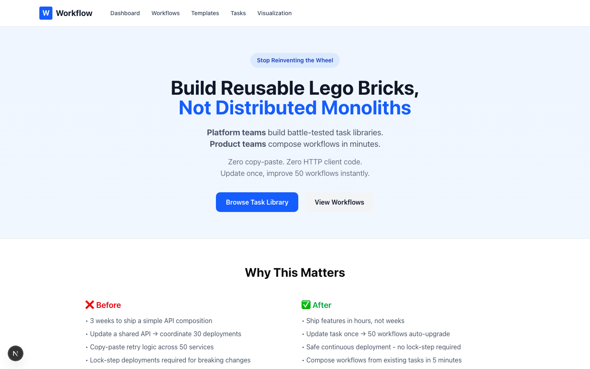
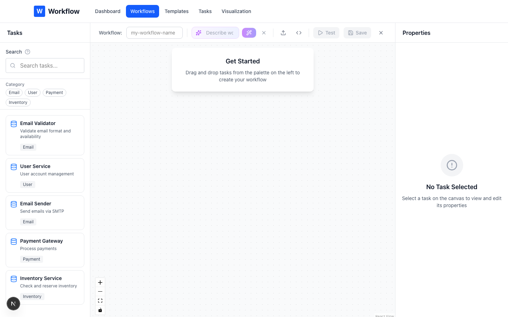
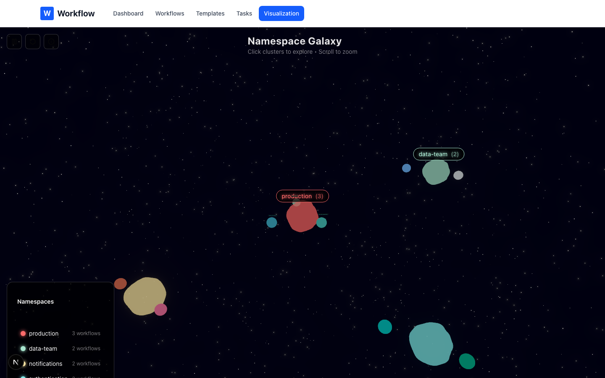
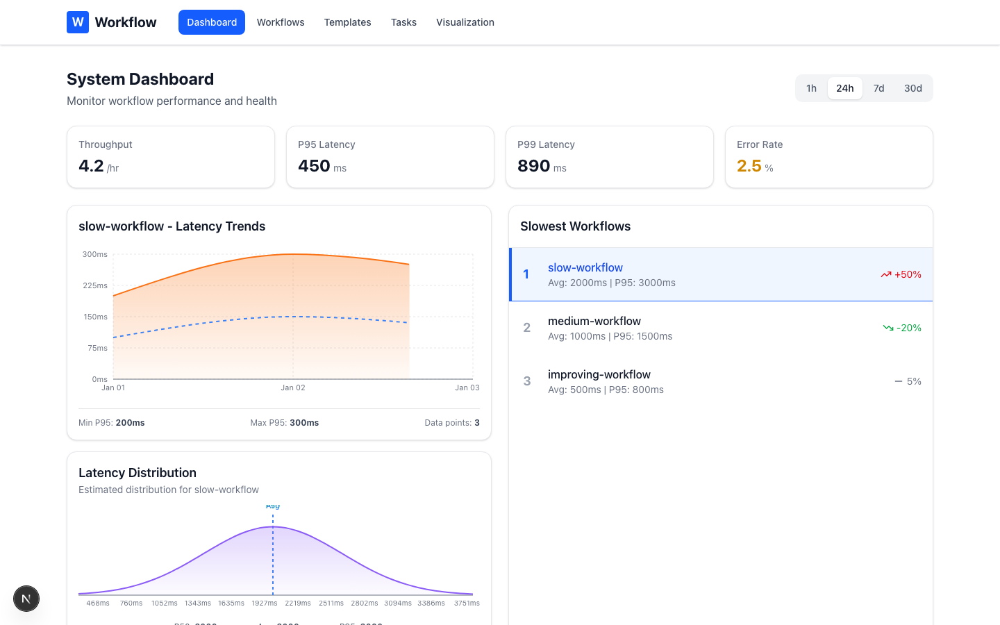

# Workflow Operator

**Stop reinventing the wheel. Build reusable Lego bricks, not monoliths.**

A Kubernetes-native workflow orchestration engine that enables **platform teams to build battle-tested task libraries** and **product teams to compose workflows in minutes** - without writing HTTP client code, retry logic, or auth handling ever again.

Built with .NET 8 for synchronous, user-facing API calls with production-grade quality (>90% test coverage, comprehensive mutation testing).

## Why This Matters

**Before Workflow Operator:**
- Every team writes their own HTTP client wrapper
- Copy-paste retry logic across 50 microservices
- Update payment provider → touch 30 different codebases
- Product teams blocked on platform team for every integration
- 3 weeks to ship a simple API composition feature

**After Workflow Operator:**
- Platform team builds **reusable task library** (payments, emails, webhooks, data transforms)
- Product teams **compose workflows from existing tasks** in 5 minutes
- Update payment task once → **50 workflows automatically use new version**
- Zero copy-paste of plumbing code
- Ship features in hours, not weeks

## Core Concept: Composable Task Library

**Platform Team Creates Lego Bricks (Tasks):**
```yaml
# Platform team owns this - used by 20+ workflows
apiVersion: workflow.example.com/v1
kind: WorkflowTask
metadata:
  name: charge-payment
  namespace: platform
  annotations:
    owner: "payments-team@company.com"
spec:
  inputSchema:
    type: object
    required: [amount, currency, customerId]
  http:
    method: POST
    url: "https://payments-api.company.com/v2/charges"
    # Built-in: retries, auth, rate limiting, idempotency
```

**Product Teams Compose Lego Models (Workflows):**
```yaml
# E-commerce checkout - reuses charge-payment task
tasks:
  - taskRef: charge-payment
    input:
      amount: "{{tasks.calculate-total.output.total}}"
      customerId: "{{input.userId}}"

# Subscription renewal - same task, different use case
tasks:
  - taskRef: charge-payment
    input:
      amount: "{{input.plan.price}}"
      customerId: "{{input.customerId}}"

# Refund workflow - reuses same battle-tested payment logic
tasks:
  - taskRef: charge-payment
    input:
      amount: "-{{input.refundAmount}}"  # Negative = refund
```

**Result:** One task, three workflows, zero duplication. Update payment logic once, all workflows benefit.

## Key Benefits

### For Platform Teams
- **Write once, use everywhere** - Build task library, not one-off integrations
- **Centralized expertise** - Payments team owns payment tasks, everyone benefits
- **Governance built-in** - Enforce security, compliance, rate limits at task level
- **Hot-swap implementations** - Upgrade task version, workflows auto-update (30s cache TTL)

### For Product Teams
- **Ship 10x faster** - Compose workflows from existing tasks in minutes
- **No plumbing code** - Never write HTTP client, retry, or auth code again
- **Contract safety** - Schema validation prevents runtime errors
- **Visual workflow builder** (Stage 9) - Non-technical users can create workflows

### For Organizations
- **Organizational scaling** - 100 teams reuse same 50 tasks
- **Consistency** - All teams use same battle-tested implementations
- **Velocity** - Features ship in hours, not weeks
- **Quality** - >90% test coverage on all tasks

## Overview

Workflow Operator is a Kubernetes operator that enables composable workflow orchestration through:
- **Reusable task library** - Platform teams build tasks, product teams compose workflows
- **Loose coupling** - Workflows reference tasks by name, implementations can change independently
- **Dynamic discovery** - Tasks discovered at runtime, hot-swapping enabled
- **Contract enforcement** - JSON Schema validation for all inputs/outputs
- **Fail-fast validation** - Invalid workflows rejected at `kubectl apply` time

## Key Features

- **Kubernetes-Native**: Full CRD-based workflow and task definitions with validating admission webhooks
- **Type-Safe**: JSON Schema validation for all inputs and outputs with compile-time type checking
- **Template-Based**: Dynamic parameter binding using `{{input.x}}` and `{{tasks.y.output.z}}` syntax
- **Dependency-Aware**: Automatic execution graph building with circular dependency detection
- **Fail-Fast Validation**: Validation webhooks reject invalid workflows at `kubectl apply` time
- **Production-Ready**: >90% test coverage, comprehensive mutation testing, strict TDD development

## Screenshots

### Homepage

*Landing page highlighting the composable workflow approach*

### Visual Workflow Builder

*Drag-and-drop workflow creation with task library sidebar*

### Galaxy Visualization

*3D namespace galaxy showing workflow clusters by team*

### System Dashboard

*Real-time metrics, latency trends, and slowest workflow identification*

## Architecture

The project consists of three main components:

### 1. **WorkflowCore** (`src/WorkflowCore/`)
Shared domain models and core services used across all components:
- Schema definition and validation (JsonSchema.Net)
- Template parsing and resolution
- Type compatibility checking
- Execution graph building
- HTTP task execution with retry policies

### 2. **WorkflowOperator** (`src/WorkflowOperator/`)
Kubernetes operator built with KubeOps 8.x:
- Custom resource controllers for WorkflowTask and Workflow CRDs
- Validating admission webhooks for fail-fast validation
- Reconciliation loops for resource status management

### 3. **WorkflowGateway** (`src/WorkflowGateway/`)
API Gateway for workflow execution:
- Synchronous workflow execution API
- Workflow discovery and validation
- Real-time execution monitoring
- Integration with Kubernetes operator

## Getting Started

### Quick Start: From Zero to Workflow in 5 Minutes

**1. Deploy the platform's task library:**
```bash
# Platform team creates reusable tasks (one-time setup)
kubectl apply -f tasks/fetch-user.yaml
kubectl apply -f tasks/send-email.yaml
kubectl apply -f tasks/charge-payment.yaml
```

**2. Product team composes a workflow:**
```bash
# Create workflow YAML (or use visual builder in Stage 9)
cat > my-workflow.yaml <<EOF
apiVersion: workflow.example.com/v1
kind: Workflow
metadata:
  name: user-welcome
spec:
  tasks:
    - id: get-user
      taskRef: fetch-user     # Reuse existing task
      input:
        userId: "{{input.userId}}"

    - id: welcome-email
      taskRef: send-email     # Reuse existing task
      input:
        to: "{{tasks.get-user.output.email}}"
        subject: "Welcome!"
EOF

kubectl apply -f my-workflow.yaml
```

**3. Execute the workflow:**
```bash
curl -X POST http://localhost:8080/api/v1/workflows/user-welcome/execute \
  -H "Content-Type: application/json" \
  -d '{"userId": "user-123"}'

# Response: {"email_sent": true, "user_name": "John Doe"}
```

**Result:** You just composed a 2-task workflow in 30 seconds without writing any HTTP client code, retry logic, or error handling. That's the power of reusability.

### Prerequisites

- .NET 8 SDK
- Docker (for running tests with TestContainers)
- Kubernetes cluster (for operator deployment) - optional for development

### Building the Solution

```bash
# Clone the repository
cd workflow

# Restore dependencies
dotnet restore

# Build all projects
dotnet build

# Run all tests
dotnet test

# Run tests with coverage
dotnet test --collect:"XPlat Code Coverage"
```

### Running Tests

```bash
# Run all tests
dotnet test

# Run specific project tests
dotnet test tests/WorkflowCore.Tests/
dotnet test tests/WorkflowOperator.Tests/
dotnet test tests/WorkflowGateway.Tests/

# Run with coverage report
dotnet test --collect:"XPlat Code Coverage"
dotnet tool install --global dotnet-reportgenerator-globaltool
reportgenerator -reports:tests/**/coverage.cobertura.xml -targetdir:coverage/report -reporttypes:Html
```

### Mutation Testing

This project uses Stryker.NET for mutation testing to ensure test quality:

```bash
# Run mutation testing for WorkflowCore
cd tests/WorkflowCore.Tests
dotnet stryker --config-file ../../stryker-config-workflowcore.json

# Run mutation testing for WorkflowOperator
cd tests/WorkflowOperator.Tests
dotnet stryker --config-file ../../stryker-config-workflowoperator.json

# Run mutation testing for WorkflowGateway
cd tests/WorkflowGateway.Tests
dotnet stryker --config-file ../../stryker-config-workflowgateway.json
```

Target mutation score: **≥80%**

## Project Structure

```
workflow/
├── src/
│   ├── WorkflowCore/              # Shared domain models and services
│   ├── WorkflowOperator/          # Kubernetes operator (KubeOps)
│   └── WorkflowGateway/           # API gateway for workflow execution
├── tests/
│   ├── WorkflowCore.Tests/        # Unit tests for WorkflowCore
│   ├── WorkflowOperator.Tests/    # Unit tests for WorkflowOperator
│   └── WorkflowGateway.Tests/     # Unit tests for WorkflowGateway
├── deploy/
│   └── crds/                      # Custom Resource Definitions
├── stryker-config-*.json          # Mutation testing configurations
├── CLAUDE.md                      # Project specification
└── README.md                      # This file
```

## Real-World Example: Task Reusability in Action

### Step 1: Platform Team Creates Reusable Tasks

**Task Library (Built Once, Used Everywhere):**

```yaml
# tasks/fetch-user.yaml - User service integration
apiVersion: workflow.example.com/v1
kind: WorkflowTask
metadata:
  name: fetch-user
  annotations:
    owner: "user-service-team@company.com"
spec:
  type: http
  inputSchema:
    type: object
    required: [userId]
    properties:
      userId: { type: string }
  outputSchema:
    type: object
    properties:
      name: { type: string }
      email: { type: string }
      tier: { type: string, enum: [free, premium, enterprise] }
  http:
    method: GET
    url: "https://api.example.com/users/{{input.userId}}"
    headers:
      Authorization: "Bearer {{env.USER_SERVICE_TOKEN}}"

---
# tasks/send-email.yaml - Email service integration
apiVersion: workflow.example.com/v1
kind: WorkflowTask
metadata:
  name: send-email
  annotations:
    owner: "notifications-team@company.com"
spec:
  type: http
  inputSchema:
    type: object
    required: [to, subject, body]
  http:
    method: POST
    url: "https://api.example.com/emails"
    headers:
      Authorization: "Bearer {{env.EMAIL_SERVICE_TOKEN}}"

---
# tasks/charge-payment.yaml - Payment processing
apiVersion: workflow.example.com/v1
kind: WorkflowTask
metadata:
  name: charge-payment
  annotations:
    owner: "payments-team@company.com"
spec:
  type: http
  inputSchema:
    type: object
    required: [amount, currency, customerId]
  http:
    method: POST
    url: "https://payments-api.company.com/v2/charges"
```

### Step 2: Product Teams Compose Workflows from Task Library

**Workflow 1: Order Fulfillment (E-Commerce Team)**
```yaml
apiVersion: workflow.example.com/v1
kind: Workflow
metadata:
  name: order-fulfillment
spec:
  tasks:
    - id: get-customer
      taskRef: fetch-user        # ← Reuse #1
      input:
        userId: "{{input.customerId}}"

    - id: charge-customer
      taskRef: charge-payment    # ← Reuse #2
      input:
        amount: "{{input.orderTotal}}"
        customerId: "{{input.customerId}}"

    - id: send-confirmation
      taskRef: send-email        # ← Reuse #3
      input:
        to: "{{tasks.get-customer.output.email}}"
        subject: "Order Confirmed"
        body: "Your order has been confirmed!"
```

**Workflow 2: Subscription Renewal (Subscriptions Team)**
```yaml
apiVersion: workflow.example.com/v1
kind: Workflow
metadata:
  name: subscription-renewal
spec:
  tasks:
    - id: get-subscriber
      taskRef: fetch-user        # ← Same task, different context
      input:
        userId: "{{input.subscriberId}}"

    - id: renew-subscription
      taskRef: charge-payment    # ← Same payment logic
      input:
        amount: "{{input.planPrice}}"
        customerId: "{{input.subscriberId}}"

    - id: send-renewal-notice
      taskRef: send-email        # ← Same email service
      input:
        to: "{{tasks.get-subscriber.output.email}}"
        subject: "Subscription Renewed"
```

**Workflow 3: User Onboarding (Growth Team)**
```yaml
apiVersion: workflow.example.com/v1
kind: Workflow
metadata:
  name: user-onboarding
spec:
  tasks:
    - id: get-new-user
      taskRef: fetch-user        # ← Same task, third use case
      input:
        userId: "{{input.userId}}"

    - id: send-welcome-email
      taskRef: send-email        # ← Same email service
      input:
        to: "{{tasks.get-new-user.output.email}}"
        subject: "Welcome to our platform!"
```

### The Power of Reusability

**3 tasks × 3 workflows = 9 integrations, zero duplication**

- `fetch-user` task used 3 times across different teams
- `send-email` task used 3 times for different purposes
- `charge-payment` task used 2 times for different billing scenarios

**What happens when you upgrade the payment provider?**
```bash
# Update ONE file
kubectl apply -f tasks/charge-payment.yaml

# 30 seconds later: Both order-fulfillment AND subscription-renewal workflows
# automatically use the new payment provider. Zero code changes.
```

## Development Workflow

This project follows strict **Test-Driven Development (TDD)**:

1. **RED**: Write a failing test
2. **GREEN**: Write minimal code to pass the test
3. **REFACTOR**: Improve code while keeping tests green

### Quality Gates

- ✅ All tests must pass (100%)
- ✅ Code coverage ≥90%
- ✅ Mutation score ≥80%
- ✅ No compiler warnings
- ✅ Zero tolerance for test failures

## Technology Stack

- **.NET 8** with ASP.NET Core
- **System.Text.Json** for serialization
- **KubeOps 8.x** for Kubernetes operator
- **JsonSchema.Net 5.x** for schema validation
- **xUnit, Moq, FluentAssertions** for testing
- **Stryker.NET** for mutation testing

## Documentation

- [CLAUDE.md](CLAUDE.md) - Complete project specification
- [WorkflowCore README](src/WorkflowCore/README.md) - Core services documentation
- [WorkflowOperator README](src/WorkflowOperator/README.md) - Kubernetes operator documentation
- [WorkflowGateway README](src/WorkflowGateway/README.md) - API gateway documentation

## Contributing

This project maintains strict quality standards:

1. All new features must follow TDD (test-first development)
2. All tests must pass before committing
3. Code coverage must remain ≥90%
4. Mutation score must remain ≥80%
5. No compiler warnings allowed

## License

[Add license information]

## Roadmap: Building the Composability Platform

**Completed Stages (1-7.9):** ✅
- ✅ Stage 1-4: Foundation (schemas, validation, templates, execution graph)
- ✅ Stage 5: Workflow execution engine with retry policies
- ✅ Stage 6: Kubernetes operator with validation webhooks
- ✅ Stage 7: API Gateway with dynamic workflow discovery
- ✅ Stage 7.5: Parallel execution & output mapping
- ✅ Stage 7.9: Execution traces & workflow versioning
- ✅ Stage 9.6: Binary response support (PDF, Excel, images)

**What's Next:**
- 🚧 **Stage 9: Developer Experience** - Make composability effortless
  - Stage 9.1: Visual workflow builder (drag-and-drop task composition)
  - Stage 9.2: **Task catalog UI** ← Critical for task reusability discovery
  - Stage 9.3: WebSocket API for real-time execution
  - Stage 9.4: Enhanced debugging tools
  - Stage 9.5: Interactive documentation

- 📋 **Stage 10**: Performance testing & optimization
- 📋 **Stage 11**: Cloud deployment & production hardening

**Current Focus:** Stage 9 - Making the task library browsable and composable through visual tools.

See [CLAUDE.md](CLAUDE.md) for the complete roadmap and stage completion proof files.

## Why Choose Workflow Operator?

**You should use this if:**
- ✅ You have multiple teams building similar integrations (payments, emails, webhooks)
- ✅ You're tired of copy-pasting HTTP client code across microservices
- ✅ You want platform teams to build reusable components, not one-off integrations
- ✅ You need to swap providers (Stripe → Braintree) without touching 30 codebases
- ✅ You want synchronous workflow execution (API calls return in <30s)

**You should NOT use this if:**
- ❌ You need long-running workflows (hours/days) - this is synchronous only
- ❌ You have simple, one-off integrations (overkill for single use cases)
- ❌ You don't have a platform team to build a task library
- ❌ Your organization has <5 developers (overhead not justified)
