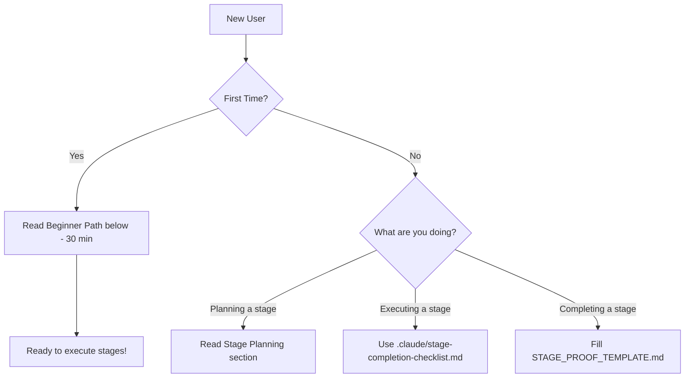

# Stage Execution Framework

**Framework Version:** 4.0.1
**Last Updated:** 2025-11-29
**Changelog:** [View Changelog](#-changelog)

> **Purpose:** Enforce production-grade quality at every stage through TDD, quality gates, and automated verification. **Generic for any .NET/TypeScript project.**

> **⚠️ BREAKING CHANGE in v4.0.0:** All gate numbers have been renumbered to match logical execution order (1 → 2 → 3...). See changelog for migration guide.

---

## 🚀 Start Here - Which Document Should I Read?

**New to this framework? Follow this path:**



**Quick Navigation:**
- 🆕 **First time?** → [5-Step Beginner Path](#-5-step-beginner-path) (30 min)
- ⚡ **Every stage:** Use [.claude/STAGE_CHECKLIST.md](./.claude/STAGE_CHECKLIST.md) **(50 lines - START HERE)**
- 📋 **Need details?** Use [.claude/stage-completion-checklist.md](./.claude/stage-completion-checklist.md) (full reference)
- ✅ **After stage:** Fill [STAGE_PROOF_TEMPLATE.md](./STAGE_PROOF_TEMPLATE.md)
- 🚀 **Experienced?** Jump to [Quality Gates](#-quality-gates-reference)

---

## 📋 Prerequisites (Install Before Starting)

### Required Software

| Software | Minimum Version | Download | Verify Command |
|----------|----------------|----------|----------------|
| **.NET SDK** | 8.0+ | [Download](https://dotnet.microsoft.com/download) | `dotnet --version` |
| **Node.js** | 18.0+ (LTS) | [Download](https://nodejs.org/) | `node --version` |
| **npm** | 9.0+ | (included with Node.js) | `npm --version` |
| **Git** | 2.30+ | [Download](https://git-scm.com/) | `git --version` |

### Recommended Tools

- **Code Editor:** VS Code, Rider, or Visual Studio 2022+
- **Terminal:** Bash, Zsh, PowerShell Core 7+
- **Docker:** For integration tests (optional)

### Operating Systems

| OS | Status | Notes |
|----|--------|-------|
| macOS | ✅ Tested on 12+ | Recommended |
| Linux | ✅ Ubuntu 20.04+, Debian 11+ | Fully supported |
| Windows | ✅ Windows 10/11 | Use WSL2 or PowerShell Core |

### Verify Prerequisites (1 min)

```bash
# Check all versions
dotnet --version    # Should show 8.0.x or higher
node --version      # Should show v18.x or higher
npm --version       # Should show 9.x or higher
git --version       # Should show 2.30.x or higher

# Install global .NET tools (optional, can install per-project)
dotnet tool install -g dotnet-reportgenerator-globaltool
dotnet tool install -g dotnet-stryker

# Verify tools installed
dotnet tool list -g
```

**✅ Prerequisites complete? → Continue to Quick Start below**

---

## 📋 Quick Start (Select Your Quality Gates)

### Decision Tree: Which Gates Do I Need?

**Answer these 4 questions:**

1. **What are you building?**
   - 🔹 Backend API (.NET) → **Gates: 1-8 + 9, 10 + 11, 13**
   - 🔹 Frontend UI (TypeScript/React) → **Gates: 1-8 + 9, 10 + 14, 15**
   - 🔹 CLI Tool → **Gates: 1-8 + 9, 10**
   - 🔹 Library/SDK → **Gates: 1-8 + 9, 10**
   - 🔹 Documentation Only → **Gates: 10 (just docs)**

2. **Is performance critical?**
   - YES → **Add Gate 12 (Performance Benchmarks - was Gate 11)**
   - NO → Skip Gate 12

3. **Is this user-facing?**
   - YES → **Add Gates 14 (Accessibility), 15 (E2E)**
   - NO → Skip

4. **Is this production code?**
   - YES → Run all applicable gates
   - NO (POC/Learning) → **Use Beginner Path (see below)**

### Quick Reference Table

| Stage Type | Mandatory Gates | Recommended | Optional |
|------------|----------------|-------------|----------|
| .NET Backend | 1-8 | 9, 10 | 11, 13 |
| .NET API | 1-8 | 9, 10 | 11, 13, 16 |
| TypeScript UI | 1-8, 14, 15, 21 | 9, 10 | - |
| TypeScript Backend | 1-8 | 9, 10 | 11 |
| Performance-Critical | 1-8 | 9, 10 | 12 |
| CLI Tool | 1-8 | 9, 10 | - |
| Library/SDK | 1-8 | 9, 10 | - |

**Gate Numbers:**
- **1-8:** Mandatory (TIER 1) - Note: Gate 4 is TypeScript only
- **9-10:** Recommended (TIER 2)
- **11-20:** Optional (TIER 3)

**Execution Order:** Always run gates in numeric order: **1 → 2 → 3 → (4 for TS) → 5 → 6 → 7 → 8**

---

## 🔰 5-Step Beginner Path

**New to this framework? Start here (30 min total):**

### Step 1: Understand the "Why" (5 min)

**Quality gates prevent broken code from reaching production:**
- ✅ **TDD** catches bugs at design time, not production
- ✅ **90% coverage** ensures code is testable and tested
- ✅ **Linting** enforces consistent style (no bikeshedding)
- ✅ **Type safety** prevents runtime crashes (TypeScript)

**Without quality gates:**
- ❌ Bugs found in production (expensive, reputation damage)
- ❌ Inconsistent code style (hard to review, maintain)
- ❌ Low test coverage (fragile refactoring)
- ❌ Security vulnerabilities (CVEs, exploits)

### Step 2: Identify Your Tech Stack (1 min)

**What are you building?**
- .NET Backend/API? → See ".NET Backend" row in table above
- TypeScript UI? → See "TypeScript UI" row
- Both? → Run both sets of gates

### Step 3: Verify Prerequisites (5 min)

```bash
# Run prerequisite checks from Prerequisites section above
dotnet --version    # 8.0+?
node --version      # 18.0+?
git --version       # 2.30+?

# Install missing tools now (not mid-stage!)
```

### Step 4: Read Execution Order (10 min)

**Understand the 8-step BEFORE → DURING → AFTER flow:**

1. **BEFORE:** Review objectives, select gates, verify tools, create proof file
2. **DURING:** TDD cycle (RED → GREEN → REFACTOR), run tests continuously
3. **AFTER:** Run quality gates, fill proof file, commit, tag

**See [Stage Execution Steps](#-stage-execution-steps) for details**

### Step 5: See Working Example (10 min)

**Open an existing proof file to see what "done" looks like:**

1. Find `stage-proofs/stage-1/STAGE_1_PROOF.md` (or any completed stage)
2. Read the **Principal Engineer Review** section
3. This is your template - copy this structure

**Total: ~30 min → Ready to execute stages 2-3x faster with confidence**

---

## ⚡ Parallel Stage Execution with Git Worktrees

### Why Parallel Stages?

**Benefits:**
- **2-4x faster delivery** - Work on multiple stages simultaneously
- **Context preservation** - Each stage has dedicated environment
- **Independent testing** - Run quality gates in parallel
- **Risk isolation** - Issues in one stage don't block others

### ✅ When to Use Parallel Execution

**USE parallel execution when:**
- ✅ Team size ≥2 (multiple developers working simultaneously)
- ✅ Stages are independent (different modules/features)
- ✅ Stage duration >1 week (overhead worth it)
- ✅ Experienced with framework (not learning)
- ✅ Clear file ownership (no overlapping changes)

### ❌ When NOT to Use Parallel Execution

**DON'T use parallel execution when:**
- ❌ Team size = 1 (no benefit, just overhead)
- ❌ Stages are tightly coupled (shared files, database migrations)
- ❌ POC or learning project (keep it simple)
- ❌ Stage duration <3 days (overhead not worth it)
- ❌ First time using this framework (master sequential first)

**🎓 Start Simple:** New to this framework? Execute stages **sequentially** first (1-2 stages). Add parallelism after you're comfortable with the workflow.

### Git Worktree Setup

**What are Worktrees?**
Multiple working directories from the same git repository. Each worktree can be on a different branch, allowing parallel development.

**Setup Commands:**
```bash
# 1. Create main worktree (if not already in one)
cd /path/to/your-project
git worktree list  # Check current worktrees

# 2. Create worktrees for parallel stages
git worktree add ../your-project-stage-9.1 -b stage-9.1
git worktree add ../your-project-stage-9.2 -b stage-9.2
git worktree add ../your-project-stage-10 -b stage-10

# 3. Verify worktrees created
git worktree list
# Output:
# /path/to/your-project                    abc123 [master]
# /path/to/your-project-stage-9.1         def456 [stage-9.1]
# /path/to/your-project-stage-9.2         789ghi [stage-9.2]
```

**Directory Structure:**
```
/path/to/
├── your-project/              # Main worktree (master branch)
├── your-project-stage-9.1/    # Worktree for Stage 9.1
├── your-project-stage-9.2/    # Worktree for Stage 9.2
└── your-project-stage-10/     # Worktree for Stage 10
```

### Stage Independence Guidelines

**✅ GOOD - Stages Can Run in Parallel:**
- Different modules (UI Builder vs Template Library)
- Different tech stacks (Backend .NET vs Frontend TypeScript)
- Different layers (Core logic vs API layer)
- Independent features (Authentication vs Dashboard)

**❌ BAD - Stages Must Run Sequentially:**
- Dependent stages (Stage 2 depends on Stage 1 models)
- Shared file modifications (both modify same controller)
- Database schema changes (migration conflicts)
- Breaking API changes (one stage changes contract, other consumes it)

### Parallel Execution Workflow (6 Steps)

**Step 1: Plan Stage Decomposition** (15 min)
```bash
# Before starting, analyze dependencies
# Create dependency graph (see Stage Planning section below)
#
#   Stage 9.1 (Visual Builder)
#        ↓
#   Stage 9.4 (Debugging - depends on 9.1)
#
#   Stage 9.2 (Templates) - INDEPENDENT
#   Stage 9.3 (WebSocket) - INDEPENDENT

# Identify parallel groups:
# Group A: 9.1, 9.2, 9.3 (can run together)
# Group B: 9.4 (waits for 9.1)
```

**Step 2: Create Worktrees** (5 min)
```bash
# Create worktree for each parallel stage
git worktree add ../your-project-stage-9.1 -b stage-9.1
git worktree add ../your-project-stage-9.2 -b stage-9.2
git worktree add ../your-project-stage-9.3 -b stage-9.3

# Open each in separate terminal/IDE
code /path/to/your-project-stage-9.1  # VSCode window 1
code /path/to/your-project-stage-9.2  # VSCode window 2
code /path/to/your-project-stage-9.3  # VSCode window 3
```

**Step 3: Execute Stages in Parallel** (concurrent)
```bash
# Terminal 1: Stage 9.1
cd /path/to/your-project-stage-9.1
# Run full stage workflow (TDD, quality gates, proof)

# Terminal 2: Stage 9.2
cd /path/to/your-project-stage-9.2
# Run full stage workflow (TDD, quality gates, proof)

# Terminal 3: Stage 9.3
cd /path/to/your-project-stage-9.3
# Run full stage workflow (TDD, quality gates, proof)
```

**Step 4: Complete Stages Independently**
```bash
# Each worktree completes independently:
# - Write tests (RED)
# - Implement code (GREEN)
# - Refactor (REFACTOR)
# - Run quality gates
# - Create proof file
# - Commit + tag

# Stage 9.1 completes:
cd /path/to/your-project-stage-9.1
git add .
git commit -m "✅ Stage 9.1 Complete: [Feature Name]"
git tag -a stage-9.1-complete -m "Stage 9.1 complete"
git push origin stage-9.1 --tags
```

**Step 5: Merge in Order** (sequential merging)
```bash
# IMPORTANT: Merge stages in dependency order
# Even if 9.3 finishes first, merge 9.1 → 9.2 → 9.3

# 1. Merge Stage 9.1 (no dependencies)
cd /path/to/your-project
git checkout master
git merge stage-9.1 --no-ff -m "Merge Stage 9.1: [Feature Name]"

# 2. Merge Stage 9.2 (no dependencies)
git merge stage-9.2 --no-ff -m "Merge Stage 9.2: [Feature Name]"

# 3. Merge Stage 9.3 (no dependencies)
git merge stage-9.3 --no-ff -m "Merge Stage 9.3: [Feature Name]"

# 4. Push integrated work
git push origin master
```

**Step 6: Cleanup Worktrees**
```bash
# After successful merge, remove worktrees
git worktree remove ../your-project-stage-9.1
git worktree remove ../your-project-stage-9.2
git worktree remove ../your-project-stage-9.3

# Delete remote branches (optional)
git push origin --delete stage-9.1 stage-9.2 stage-9.3
```

### Artifact Isolation (CRITICAL)

**Each worktree has independent artifacts:**
```bash
# Stage 9.1 artifacts
/path/to/your-project-stage-9.1/stage-proofs/stage-9.1/

# Stage 9.2 artifacts
/path/to/your-project-stage-9.2/stage-proofs/stage-9.2/

# Stage 9.3 artifacts
/path/to/your-project-stage-9.3/stage-proofs/stage-9.3/

# After merge, all artifacts preserved in master:
/path/to/your-project/stage-proofs/
├── stage-9.1/
├── stage-9.2/
└── stage-9.3/
```

**No conflicts** because each stage has its own folder!

### Performance Gains

**Sequential Execution:**
```
Stage 9.1 (2 weeks) → Stage 9.2 (1 week) → Stage 9.3 (2 weeks) = 5 weeks total
```

**Parallel Execution:**
```
Stage 9.1 (2 weeks) ┐
Stage 9.2 (1 week)  ├─ Parallel = 2 weeks total (longest stage)
Stage 9.3 (2 weeks) ┘

Savings: 3 weeks (60% faster!)
```

### Best Practices

**DO:**
- ✅ Plan dependencies upfront (create dependency graph)
- ✅ Keep stages small (1-2 weeks max)
- ✅ Use clear file ownership (no overlapping changes)
- ✅ Merge in dependency order (even if finished out of order)
- ✅ Run quality gates in each worktree independently
- ✅ Commit stage proof files before merging

**DON'T:**
- ❌ Modify same files in parallel stages (causes conflicts)
- ❌ Share database migrations across parallel stages
- ❌ Create circular dependencies (Stage A needs B, B needs A)
- ❌ Merge stages out of dependency order
- ❌ Skip quality gates because "it's just a small stage"

---

## 📐 How to Plan Stages for Parallelism

### Stage Decomposition Checklist

**Before planning a large stage (>2 weeks), ask:**

1. **Can this be split into independent features?**
   - ✅ YES: Large feature → Multiple independent sub-features
   - ❌ NO: Tightly coupled logic

2. **Do features touch different files/modules?**
   - ✅ YES: UI components in `/components/`, API in `/api/`, services in `/services/`
   - ❌ NO: All changes in same controller file

3. **Are there clear dependency chains?**
   - ✅ YES: Feature A → Feature B (B depends on A)
   - ❌ NO: Circular dependencies (A needs B, B needs A)

4. **Can each substage deliver value independently?**
   - ✅ YES: Each substage is a complete feature users can interact with
   - ❌ NO: Partial implementation, needs other stages to work

5. **Are substages roughly equal size (1-2 weeks)?**
   - ✅ YES: Balanced workload
   - ❌ NO: One stage is 5 weeks, another is 1 day (imbalanced)

### Stage Sizing Guidelines

**Ideal Substage Size:**
- **1-2 weeks** per substage
- **20-50 tests** per substage
- **500-2000 lines** of code per substage
- **3-8 files** created/modified per substage

### Example: Stage Decomposition

**❌ TOO BIG: Original Stage (6.5 weeks)**

```markdown
## Stage 9: User Dashboard Feature (6.5 weeks)

### Deliverables:
1. Dashboard UI Components (2 weeks)
2. Data Visualization Library (1 week)
3. Real-Time Updates via WebSocket (2 weeks)
4. Analytics & Reporting (1.5 weeks)
```

**✅ REFACTORED: Stage 9.1-9.4 (2 weeks with parallelism)**

```markdown
## Stage 9.1: Dashboard UI Components (2 weeks)
**Files:**
- `src/web-ui/app/dashboard/page.tsx`
- `src/web-ui/components/dashboard/widgets.tsx`
- `src/web-ui/components/dashboard/layout.tsx`

**Dependencies:** None
**Parallel Group:** A (can run with 9.2, 9.3)

---

## Stage 9.2: Data Visualization Library (1 week)
**Files:**
- `src/web-ui/lib/charts/index.ts`
- `src/web-ui/components/charts/bar-chart.tsx`
- `docs/charts-usage.md`

**Dependencies:** None
**Parallel Group:** A (can run with 9.1, 9.3)

---

## Stage 9.3: Real-Time WebSocket API (2 weeks)
**Files:**
- `src/api/Hubs/DashboardHub.cs`
- `src/web-ui/lib/stores/websocket-store.ts`

**Dependencies:** Existing API layer (from Stage 7)
**Parallel Group:** A (can run with 9.1, 9.2)

---

## Stage 9.4: Analytics & Reporting (1.5 weeks)
**Files:**
- `src/web-ui/components/analytics/reports.tsx`
- `src/web-ui/components/analytics/filters.tsx`

**Dependencies:** Stage 9.1 (uses Dashboard UI components)
**Parallel Group:** B (sequential, waits for 9.1)

---

**Execution Plan:**
- Week 1-2: Run 9.1, 9.2, 9.3 in parallel (3 worktrees)
- Week 3: Run 9.4 (depends on 9.1)
- Total: 3 weeks vs 6.5 weeks sequential (54% faster!)
```

### Dependency Graph Template

**Create this BEFORE starting any stage:**

```
Stage X Dependency Graph
========================

Independent (Parallel Group A):
- Stage X.1: [Name] - [Duration]
- Stage X.2: [Name] - [Duration]
- Stage X.3: [Name] - [Duration]

Dependent (Parallel Group B):
- Stage X.4: [Name] - [Duration] (depends on X.1)

Execution Timeline:
Week 1-2: X.1, X.2, X.3 (parallel in 3 worktrees)
Week 3:   X.4 (sequential, after X.1 merges)

Total: 3 weeks (vs 6 weeks sequential = 50% faster)
```

### Stage Planning Template

**For each substage, document:**

```markdown
## Stage X.Y: [Name]

**Duration:** [1-2 weeks]
**Priority:** [P0 Critical / P1 Important / P2 Nice-to-have]

**Files Created/Modified:**
- `path/to/file1.ts` (new)
- `path/to/file2.cs` (modify)
- `docs/feature.md` (new)

**Dependencies:**
- **Required:** Stage X.Y-1 (needs X.Y-1 models/components)
- **Optional:** None

**Parallel Group:** [A/B/C/Sequential]
**Can run in parallel with:** [X.1, X.2] or [None - must run alone]

**Deliverables:**
- [ ] Feature implementation (X files, ~Y lines)
- [ ] Unit tests (≥90% coverage, ~Z tests)
- [ ] Integration tests (~W tests)
- [ ] Documentation (README, ADRs if needed)
- [ ] Quality gates passed (mandatory + optional)
- [ ] Proof file created

**Value Delivered:**
[1-2 sentences: What can users/developers DO with this substage independently?]

Example: "Developers can build interactive dashboards with drag-and-drop widgets. Dashboards can be saved and exported as JSON."
```

### Common Parallelism Patterns

**Pattern 1: Layer-Based (Backend → Frontend)**
```
Stage X.1: Data Models + Repository (1 week) - Sequential
    ↓
Stage X.2: API Endpoints (1 week) ┐
Stage X.3: UI Components (1 week) ┘ Parallel

Total: 2 weeks (vs 3 weeks sequential)
```

**Pattern 2: Feature-Based (Independent Features)**
```
Stage 9.1: Dashboard UI       ┐
Stage 9.2: Visualization Lib  ├─ All Parallel
Stage 9.3: WebSocket API      ┘

Total: 2 weeks (longest stage) vs 5 weeks sequential
```

**Pattern 3: Tech Stack Parallelism**
```
Stage X.1: .NET Backend API     ┐
Stage X.2: TypeScript Frontend  ┘ Parallel

Total: 2 weeks (vs 4 weeks sequential)
```

**Pattern 4: Component Isolation (UI)**
```
Stage X.1: Auth Component       ┐
Stage X.2: Dashboard Component  ├─ All Parallel
Stage X.3: Settings Component   ┘

Total: 2 weeks (vs 6 weeks sequential)
```

### Validation Checklist

**Before creating worktrees, verify:**

- [ ] **File Ownership:** Each substage has clear, non-overlapping file ownership
- [ ] **Independence:** Each substage can pass quality gates independently
- [ ] **Test Isolation:** No shared test fixtures or mocks between substages
- [ ] **Acyclic Dependencies:** Dependency graph has no circular dependencies
- [ ] **Balanced Sizing:** Substages are similar duration (~1-2 weeks each)
- [ ] **Merge Order:** Clear merge sequence documented (dependency order)
- [ ] **Shared Files:** Coordination plan for package.json, .csproj, etc.
- [ ] **Value Delivery:** Each substage delivers independent user/developer value

**If any checkbox is ❌, refactor the stage plan before proceeding.**

---

## 🚀 Stage Execution Steps (STRICT ORDER)

### BEFORE Starting

**1. Review Stage Objectives** (5 min)
- Read stage description in your project's main spec document
- Understand what will be built and why it matters
- Identify dependencies on previous stages

**2. Select Quality Gates** (2 min)
- Use [Decision Tree](#decision-tree-which-gates-do-i-need) above
- Document selection in proof file
- Explain why each optional gate is included/skipped

**3. Verify Tools** (5 min)
```bash
# .NET Core Tools
dotnet --version                    # Should be 8.0+
dotnet tool list -g                 # Check reportgenerator, stryker

# TypeScript/Node.js
node --version && npm --version     # Node 18+

# Quality Gate Tools (install as needed)
npx playwright --version            # E2E testing (Gate 15)
npx oxlint --version                # Fast linting (Gate 2)
npx @axe-core/cli --version         # Accessibility (Gate 14)
npx @lhci/cli --version             # Lighthouse CI (Gates 11, 14)
npx typedoc --version               # API docs (Gate 10)
npx @openapitools/openapi-generator-cli version  # API contracts (Gate 13)

# Install missing tools:
# npm install -D oxlint @axe-core/cli
# npm install -g @lhci/cli typedoc @openapitools/openapi-generator-cli playwright
# dotnet tool install -g xmldocmd dotnet-reportgenerator-globaltool dotnet-stryker
```

**4. Create Proof File** (2 min)
```bash
cp STAGE_PROOF_TEMPLATE.md stage-proofs/stage-X/STAGE_X_PROOF.md
# Fill in stage number, date, selected gates
```

**5. Create Todo List** (3 min)
- Break stage into tasks from deliverables
- Track progress as you implement

**6. Plan Storybook Stories (TypeScript UI only)** (5 min)
- List all UI components to be created this stage
- Plan story variants for each component:
  - Default state (required)
  - Loading/empty states (if applicable)
  - Error states (if applicable)
  - Edge cases (long text, missing data, etc.)
  - Interactive states (hover, focus, active)

**Total: 15-20 minutes → Proceed to implementation**

---

### DURING Implementation

**TDD Cycle (RED → GREEN → REFACTOR):**

1. **RED**: Write failing test first
2. **GREEN**: Write minimal code to pass
3. **REFACTOR**: Clean up while keeping tests green
4. **COMMIT**: Commit working code frequently

**Progress Tracking:**
- Update todo list as tasks complete
- Run tests after every change: `dotnet watch test` or `npm test -- --watch`
- Maintain ≥90% coverage continuously

**Storybook Stories (TypeScript UI only):**

For each UI component created, create a story file alongside it:

```
components/
├── my-component.tsx
├── my-component.test.tsx
└── my-component.stories.tsx  ← Required for FRONTEND_TS profile
```

**Story requirements:**
- Include `Default` story with typical props
- Include state variants (Loading, Empty, Error as applicable)
- Include edge case variants (long text, missing data)
- Add `tags: ['autodocs']` for auto-documentation
- Verify stories render: `npm run storybook`

**Story template:**
```typescript
import type { Meta, StoryObj } from '@storybook/react';
import { MyComponent } from './my-component';

const meta = {
  title: 'Category/MyComponent',
  component: MyComponent,
  parameters: { layout: 'centered' },
  tags: ['autodocs'],
} satisfies Meta<typeof MyComponent>;

export default meta;
type Story = StoryObj<typeof meta>;

export const Default: Story = {
  args: { /* typical props */ },
};
```

---

### AFTER Implementation

**Run Quality Gates** (see [Quality Gates Reference](#-quality-gates-reference) below)

**Execution Order (Fast-Fail):**
1. Gate 1: No Template Files (5 sec)
2. Gate 2: Linting (10-30 sec)
3. Gate 3: Clean Build (1-3 min)
4. Gate 4: Type Safety [TypeScript only] (10-20 sec)
5. Gate 5: All Tests Passing (1-5 min)
6. Gate 6: Code Coverage ≥90% (same run)
7. Gate 7: Zero Vulnerabilities (10-30 sec)
8. Gate 8: Proof Completeness (5 sec)

**Then run optional gates:** 7 (Mutation), 13 (Documentation), 10-12, 14-20

**Complete proof file, commit, tag** (see [.claude/stage-completion-checklist.md](./.claude/stage-completion-checklist.md) for details)

---

## 🎯 Quality Gates Reference

### Gate Tier Structure

```
TIER 1: MANDATORY (8 gates - always required)
├── Gate 1: No Template Files
├── Gate 2: Linting
├── Gate 3: Clean Build
├── Gate 4: Type Safety (TypeScript only)
├── Gate 5: All Tests Passing
├── Gate 6: Code Coverage ≥90%
├── Gate 7: Zero Vulnerabilities
└── Gate 8: Proof Completeness

TIER 2: RECOMMENDED (2 gates - strongly encouraged)
├── Gate 9: Mutation Testing (≥80%)
└── Gate 10: Documentation Completeness

TIER 3: OPTIONAL (11 gates - context-dependent)
├── Gate 11: Integration Tests
├── Gate 12: Performance Benchmarks
├── Gate 13: API Contract Validation
├── Gate 14: Accessibility Testing (UI - MANDATORY for FRONTEND_TS)
├── Gate 15: E2E Tests (UI - MANDATORY for FRONTEND_TS)
├── Gate 16: SAST
├── Gate 17: Observability Readiness
├── Gate 18: Code Complexity Analysis
├── Gate 19: Dependency Freshness
├── Gate 20: Beginner Path
└── Gate 21: Storybook Stories (UI - MANDATORY for FRONTEND_TS)
```

---

### ⭐ TIER 1: MANDATORY GATES (Always Required)

**Execution Order:** 5 → 8 → 1 → (9 for TS) → 2 → 3 → 4 → 6

---

<details>
<summary><strong>Gate 1: No Template Files</strong> (MANDATORY - Run FIRST)</summary>

**Order:** 1st (5 seconds)
**Why First:** Don't even attempt to build with Class1.cs or WeatherForecast.cs lying around

**.NET:**
```bash
find . -name "Class1.cs" -o -name "UnitTest1.cs" -o -name "WeatherForecast.cs"
```

**TypeScript:**
```bash
find . -name "App.test.tsx" -path "*/src/App.test.tsx" -o -name "setupTests.ts"
```

**Pass Criteria:**
- ✅ No template files found (empty output)
- ❌ BLOCKER if any template files exist

**Common Template Files:**
- .NET: `Class1.cs`, `UnitTest1.cs`, `WeatherForecast.cs`, `Program.cs` (if auto-generated)
- TypeScript: `App.test.tsx` (from CRA), `setupTests.ts`, `reportWebVitals.ts`

</details>

---

<details>
<summary><strong>Gate 2: Linting & Code Style</strong> (MANDATORY - Run 2nd)</summary>

**Order:** 2nd (2-60 seconds depending on tech stack)
**Why Early:** Catch style issues before compiling (fast feedback)

**Purpose:** Enforce consistent code style and catch common errors

**.NET:**
```bash
dotnet format --verify-no-changes 2>&1 | tee ./stage-proofs/stage-X/reports/gates/gate-2-lint.txt
```

**TypeScript (Sequential Dual-Linting - Recommended):**
```bash
# Step 1: Run oxlint FIRST (fast fail-fast check - 2-5 seconds)
npx oxlint src/ 2>&1 | tee ./stage-proofs/stage-X/reports/gates/gate-2-oxlint.txt
if [ $? -ne 0 ]; then
  echo "❌ oxlint failed - stopping (ESLint skipped for speed)"
  exit 1
fi

# Step 2: Run ESLint ONLY if oxlint passed (comprehensive check - 30-60 seconds)
npm run lint 2>&1 | tee ./stage-proofs/stage-X/reports/gates/gate-2-eslint.txt
```

**Why Both Linters (TypeScript):**
- **oxlint** (2-5 sec): Ultra-fast syntax/common issues → immediate feedback
  - Install: `npm install -D oxlint`
  - 50-100x faster than ESLint
  - Catches ~80% of common issues instantly
- **ESLint** (30-60 sec): Deep analysis, security plugins, custom rules
  - Comprehensive checking with plugins (security, accessibility, etc.)
  - Catches edge cases oxlint might miss
- **Sequential = Fail-Fast:** Stop immediately if oxlint fails → saves 30-60 seconds on failures

**Pass Criteria:**
- ✅ Zero linting errors from BOTH linters (TypeScript) or dotnet format (.NET)
- ❌ BLOCKER if any linting errors from either linter

**Artifacts:**
- .NET: `./stage-proofs/stage-X/reports/gates/gate-2-lint.txt`
- TypeScript: `./stage-proofs/stage-X/reports/gates/gate-2-oxlint.txt` + `gate-2-eslint.txt`

</details>

---

<details>
<summary><strong>Gate 3: Clean Build</strong> (MANDATORY - Run 3rd)</summary>

**Order:** 3rd (1-3 minutes)
**Why After Linting:** Code must compile with zero warnings

**Purpose:** Code compiles with zero warnings

**.NET:**
```bash
dotnet clean
dotnet build --configuration Release 2>&1 | tee ./stage-proofs/stage-X/reports/gates/gate-3-build.txt
```

**TypeScript:**
```bash
npm run build 2>&1 | tee ./stage-proofs/stage-X/reports/gates/gate-3-build.txt
```

**Pass Criteria:**
- ✅ `Build succeeded. 0 Warning(s), 0 Error(s)` (.NET)
- ✅ `Build completed` (TypeScript)
- ❌ BLOCKER if any warnings or errors

**Artifacts:** `./stage-proofs/stage-X/reports/gates/gate-3-build.txt`

</details>

---

<details>
<summary><strong>Gate 4: Type Safety (TypeScript ONLY)</strong> (MANDATORY for TS - Run 4th)</summary>

**Order:** 4th (10-20 seconds)
**TypeScript Projects Only:** N/A for .NET
**Why After Build:** Explicit type-check after build (some errors slip through build)

**Purpose:** Catch type errors before runtime - prevent crashes

**CRITICAL:** Type errors cause runtime crashes - **zero tolerance**

```bash
npm run type-check 2>&1 | tee ./stage-proofs/stage-X/reports/gates/gate-4-typecheck.txt
# OR
npx tsc --noEmit 2>&1 | tee ./stage-proofs/stage-X/reports/gates/gate-4-typecheck.txt
```

**Pass Criteria:**
- ✅ `Found 0 errors` (zero type errors)
- ❌ BLOCKER if ANY type errors

**Why Separate from Build:**
- Build doesn't always catch all type errors
- Type-checking must be explicit gate

**Artifacts:** `./stage-proofs/stage-X/reports/gates/gate-4-typecheck.txt`

</details>

---

<details>
<summary><strong>Gate 5: All Tests Passing</strong> (MANDATORY - Run 5th)</summary>

**Order:** 5th (1-5 minutes)
**Why After Build:** Every test passes, zero failures

**Purpose:** Every test passes, zero failures

**.NET:**
```bash
dotnet test --configuration Release --logger "console;verbosity=detailed" \
  2>&1 | tee ./stage-proofs/stage-X/reports/gates/gate-5-tests.txt
```

**TypeScript:**
```bash
npm test 2>&1 | tee ./stage-proofs/stage-X/reports/gates/gate-5-tests.txt
```

**Pass Criteria:**
- ✅ `Passed! - Failed: 0, Passed: N, Skipped: 0`
- ❌ BLOCKER if ANY failures detected (Failed > 0)
- ❌ BLOCKER if ANY skipped tests detected (Skipped > 0)

**Why Zero Skipped Tests?**

TDD requires strict RED → GREEN → REFACTOR cycle. Skipped tests represent:
- **Incomplete implementation:** Red state never completed to green
- **Technical debt:** Tests exist but don't validate behavior
- **False coverage metrics:** Test count inflated without actual validation
- **Production risk:** Untested code paths cause bugs

**How to Fix Skipped Tests:**

```bash
# .NET: Find and remove skipped tests
grep -r "\[Fact(Skip" tests/
# Remove Skip attribute or implement the test

# TypeScript: Find and remove skipped tests
grep -r "test.skip\|it.skip\|describe.skip" src/
# Remove .skip() or implement the test

# Decision tree:
# 1. Future feature not ready? → DELETE the test (not needed yet)
# 2. Test incomplete? → IMPLEMENT the test (complete TDD cycle)
# 3. Test flaky? → FIX the test (make it deterministic)
# 4. Feature deprecated? → DELETE the test
```

**Example Error:**
```
❌ Gate 5 Failed: Skipped tests detected
Tests: 230 passed | 5 skipped (235)

Action Required:
1. Find skipped tests: grep -r "test.skip" src/
2. Either implement the test (complete TDD) or delete it (not needed)
3. Re-run: ./scripts/run-quality-gates.sh 5
```

**Artifacts:** `./stage-proofs/stage-X/reports/gates/gate-5-tests.txt`

</details>

---

<details>
<summary><strong>Gate 6: Code Coverage ≥90%</strong> (MANDATORY - Run 6th)</summary>

**Order:** 6th (same run as Gate 5)
**Why After Tests:** Code is thoroughly tested

**Purpose:** Code is thoroughly tested

**.NET:**
```bash
dotnet test --collect:"XPlat Code Coverage" --results-directory ./stage-proofs/stage-X/reports/coverage
reportgenerator -reports:./stage-proofs/stage-X/reports/coverage/**/coverage.cobertura.xml \
                -targetdir:./stage-proofs/stage-X/reports/coverage \
                -reporttypes:"Html;TextSummary;Cobertura"
cat ./stage-proofs/stage-X/reports/coverage/Summary.txt | tee ./stage-proofs/stage-X/reports/gates/gate-6-coverage.txt
```

**TypeScript:**
```bash
npm run test:coverage
cp -r coverage/ ./stage-proofs/stage-X/reports/coverage/
cat coverage/coverage-summary.txt | tee ./stage-proofs/stage-X/reports/gates/gate-6-coverage.txt
```

**Pass Criteria:**
- ✅ Line coverage ≥90%
- ❌ BLOCKER if coverage < 90%

**Artifacts:**
- `./stage-proofs/stage-X/reports/coverage/index.html` (browsable)
- `./stage-proofs/stage-X/reports/coverage/Summary.txt`

</details>

---

<details>
<summary><strong>Gate 7: Zero Security Vulnerabilities</strong> (MANDATORY - Run 7th)</summary>

**Order:** 7th (10-30 seconds)
**Why After Coverage:** No known CVEs in dependencies

**Purpose:** No known CVEs in dependencies

**.NET:**
```bash
dotnet list package --vulnerable --include-transitive | tee ./stage-proofs/stage-X/reports/gates/gate-7-security.txt
```

**TypeScript:**
```bash
npm audit --audit-level=moderate | tee ./stage-proofs/stage-X/reports/gates/gate-7-security.txt
```

**Pass Criteria:**
- ✅ `No vulnerable packages` (.NET) or `found 0 vulnerabilities` (TS)
- ❌ BLOCKER if ANY vulnerabilities (HIGH, MODERATE, or LOW)

**Artifacts:** `./stage-proofs/stage-X/reports/gates/gate-7-security.txt`

</details>

---

<details>
<summary><strong>Gate 8: Proof File Completeness</strong> (MANDATORY - Run 8th)</summary>

**Order:** 8th (5 seconds)
**Why Last:** Documentation complete

**Purpose:** Documentation complete

```bash
grep -i -E "\[(TO BE|PLACEHOLDER|TBD|TODO|PENDING|STATUS|XXX|N/N|X%)\]" ./stage-proofs/stage-X/STAGE_X_PROOF.md
```

**Pass Criteria:**
- ✅ (empty - no placeholders found)
- ❌ BLOCKER if any placeholders remain

**Verification Checklist:**
- [ ] Stage Summary table has actual numbers (e.g., `235/235`, `92.1%`, `0`)
- [ ] Test output section includes link to `./reports/test-results/test-results.xml`
- [ ] Coverage section includes link to `./reports/coverage/index.html`
- [ ] All deliverables checked `[x]`
- [ ] Principal Engineer Review is thoughtful (not generic)

</details>

---

### ⭐ TIER 2: RECOMMENDED GATES (Strongly Encouraged)

---

<details>
<summary><strong>Gate 9: Mutation Testing ≥80%</strong> (RECOMMENDED)</summary>

**Purpose:** Verify tests actually catch bugs, not just coverage

**.NET:**
```bash
dotnet stryker --config-file stryker-config.json
cp -r mutation-reports/ ./stage-proofs/stage-X/reports/mutation/
```

**TypeScript:**
```bash
npx stryker run
cp -r mutation-reports/ ./stage-proofs/stage-X/reports/mutation/
```

**Pass Criteria:**
- ✅ Mutation score ≥80%
- ⚠️ WARNING if score <80% (not blocking, but MUST be documented in proof file)

**If score <80%, document in Principal Engineer Review:**
- Why score is below target
- Which mutants survived and why
- Plan to improve in future stages

**Artifacts:**
- `./stage-proofs/stage-X/reports/mutation/index.html`
- `./stage-proofs/stage-X/reports/mutation/stryker-report.json`

</details>

---

<details>
<summary><strong>Gate 10: Documentation Completeness</strong> (RECOMMENDED)</summary>

**When to Use:**
- Public APIs
- Libraries
- Architectural changes
- UI components
- Complex algorithms

**Requirements:**
1. **README.md**: Up-to-date setup, usage, examples
2. **API Documentation**: All public APIs documented
   - .NET: XML documentation comments
   - TypeScript: JSDoc comments
3. **ADRs (Architecture Decision Records)**: For significant decisions
   - **When to Create**: New tech stack, breaking changes, major refactors, design patterns
   - **Format**: `docs/adr/NNNN-title.md` (Markdown ADR format)
   - **Template**: See ADR example below
4. **Inline Comments**: Complex logic explained (why, not what)

**Verification Commands:**
```bash
# 1. Verify README exists and is not template
[ -f README.md ] && ! grep -q "TODO\|PLACEHOLDER" README.md
echo "README check: $?" | tee -a ./stage-proofs/stage-X/reports/gates/gate-10-documentation.txt

# 2. Check ADRs for this stage (if architectural changes)
ls -la docs/adr/*.md 2>&1 | tee -a ./stage-proofs/stage-X/reports/gates/gate-10-documentation.txt

# 3. Verify API docs coverage (.NET)
dotnet tool install -g xmldocmd 2>/dev/null || true
xmldocmd ./src/*/bin/Release/net8.0/*.dll ./docs/api \
  2>&1 | tee -a ./stage-proofs/stage-X/reports/gates/gate-10-documentation.txt

# 4. Verify JSDoc coverage (TypeScript)
npx typedoc --out ./stage-proofs/stage-X/reports/typedoc src/ \
  2>&1 | tee -a ./stage-proofs/stage-X/reports/gates/gate-10-documentation.txt
```

**Pass Criteria:**
- README complete (no TODOs/placeholders)
- ADRs created for architectural decisions
- Public API documentation ≥90% coverage
- Complex logic has explanatory comments

**ADR Template:**

```markdown
# ADR-NNNN: [Title]

**Status:** Proposed | Accepted | Rejected | Deprecated
**Date:** YYYY-MM-DD
**Deciders:** [Names]

## Context
What problem are we solving? What constraints exist?

## Decision
What approach did we choose? Be specific.

## Consequences
**Positive:**
- What benefits does this bring?

**Negative:**
- What trade-offs or costs?

**Neutral:**
- What side effects?

## Alternatives Considered
1. **Option A:** Why we didn't choose it
2. **Option B:** Why we didn't choose it
```

**ADR Example:**

```markdown
# ADR-0001: Choose PostgreSQL for Application State Storage

**Status:** Accepted
**Date:** 2025-01-15
**Deciders:** Tech Lead, Backend Team

## Context

We need persistent storage for application state, user data, and transaction history. Requirements:
- Complex queries (filter by status, date range, user ID)
- ACID transactions (data must be consistent)
- Schema evolution (data models change over time)
- Relational data (users → orders → items)

## Decision

Use **PostgreSQL 15** as the primary database.

## Consequences

**Positive:**
- Strong consistency with ACID guarantees
- Rich query capabilities (JOINs, CTEs, window functions)
- JSON support for flexible data (`jsonb` type)
- Mature ecosystem (drivers, ORMs, tools)
- Free and open source

**Negative:**
- Higher operational complexity vs managed NoSQL (need backups, replication)
- Vertical scaling limits (single-node writes)
- Schema migrations required for changes

**Neutral:**
- Need Entity Framework Core for .NET integration
- Docker required for local development

## Alternatives Considered

1. **MongoDB (NoSQL Document Store)**
   - ✅ Schema flexibility
   - ❌ Weak consistency (eventual consistency model)
   - ❌ Complex queries difficult (no JOINs)
   - **Verdict:** Too risky for transactional data

2. **SQLite (Embedded Database)**
   - ✅ Zero operational overhead
   - ✅ Perfect for testing
   - ❌ No concurrent writes (locks entire DB)
   - ❌ Not production-grade for multi-tenant
   - **Verdict:** Good for dev/test, not production

3. **AWS DynamoDB (Managed NoSQL)**
   - ✅ Infinite scale
   - ✅ Zero ops (fully managed)
   - ❌ Expensive at scale
   - ❌ Vendor lock-in
   - ❌ Complex queries awkward
   - **Verdict:** Over-engineered for current needs
```

**Artifacts:**
- `./stage-proofs/stage-X/reports/gates/gate-10-documentation.txt`
- `./stage-proofs/stage-X/reports/typedoc/` (TypeScript API docs)
- `docs/adr/*.md` (ADRs - committed to repo)

</details>

---

### ⭐ TIER 3: OPTIONAL GATES (Context-Dependent)

**Only run gates that apply to your stage type. See [Decision Tree](#decision-tree-which-gates-do-i-need) above.**

---

<details>
<summary><strong>Gate 11: Integration Tests</strong> (Optional)</summary>

**When to Use:** API endpoints, database access, external services

**.NET:**
```bash
dotnet test --filter Category=Integration \
  --logger "junit;LogFilePath=./stage-proofs/stage-X/reports/test-results/integration-results.xml" \
  --results-directory ./stage-proofs/stage-X/reports/test-results \
  2>&1 | tee ./stage-proofs/stage-X/reports/gates/gate-11-integration.txt
```

**TypeScript:**
```bash
npm run test:integration -- --reporter=junit \
  --reporter-options=output=./stage-proofs/stage-X/reports/test-results/integration-results.xml \
  2>&1 | tee ./stage-proofs/stage-X/reports/gates/gate-11-integration.txt
```

**Pass Criteria:** All integration tests passing (0 failures)

**Artifacts:**
- `./stage-proofs/stage-X/reports/test-results/integration-results.xml`
- `./stage-proofs/stage-X/reports/gates/gate-11-integration.txt`

</details>

---

<details>
<summary><strong>Gate 12: Performance Regression Detection</strong> (Optional)</summary>

**When to Use:** Performance-critical features, after optimization work

**.NET:**
```bash
dotnet run --project tests/PerformanceTests --configuration Release \
  2>&1 | tee ./stage-proofs/stage-X/reports/gates/gate-12-performance.txt
cp benchmarks/results/* ./stage-proofs/stage-X/reports/benchmarks/ 2>/dev/null || true
```

**TypeScript (Backend/Node):**
```bash
npm run benchmark 2>&1 | tee ./stage-proofs/stage-X/reports/gates/gate-12-performance.txt
```

**TypeScript (Frontend/Web Performance):**
```bash
npm install -g @lhci/cli
lhci autorun --collect.url=http://localhost:3000 \
  --upload.target=filesystem \
  --upload.outputDir=./stage-proofs/stage-X/reports/lighthouse \
  2>&1 | tee ./stage-proofs/stage-X/reports/gates/gate-12-performance.txt
```

**Pass Criteria:** No regressions >10% vs baseline

**First Run:** Establishes baseline (commit baseline file: `benchmarks/baseline.json`)

**Artifacts:**
- `./stage-proofs/stage-X/reports/benchmarks/results.json`
- `./stage-proofs/stage-X/reports/lighthouse/` (web performance)

</details>

---

<details>
<summary><strong>Gate 13: API Contract Validation</strong> (Optional)</summary>

**When to Use:** Public APIs, breaking changes possible, new endpoints

**.NET:**
```bash
dotnet swagger tofile --output ./stage-proofs/stage-X/reports/openapi.json \
  ./src/[ApiProject]/bin/Release/net8.0/[ApiProject].dll v1
npx @openapitools/openapi-generator-cli validate \
  -i ./stage-proofs/stage-X/reports/openapi.json \
  2>&1 | tee ./stage-proofs/stage-X/reports/gates/gate-13-api-contract.txt
```

**TypeScript:**
```bash
npm run openapi:generate 2>&1 | tee ./stage-proofs/stage-X/reports/gates/gate-13-api-contract.txt
npx @openapitools/openapi-generator-cli validate \
  -i ./openapi.json \
  2>&1 | tee ./stage-proofs/stage-X/reports/gates/gate-13-api-contract.txt
```

**Pass Criteria:** OpenAPI spec valid, no undocumented breaking changes

**Artifacts:**
- `./stage-proofs/stage-X/reports/openapi.json`
- `./stage-proofs/stage-X/reports/gates/gate-13-api-contract.txt`

</details>

---

<details>
<summary><strong>Gate 14: Accessibility Testing</strong> (Optional - UI Only)</summary>

**When to Use:** ALL UI components, user-facing pages, forms

**Tools:**

1. **axe-core** (Automated accessibility checks):
   ```bash
   npx @axe-core/cli http://localhost:3000 \
     --save ./stage-proofs/stage-X/reports/accessibility/axe-results.json \
     --exit \
     2>&1 | tee ./stage-proofs/stage-X/reports/gates/gate-14-accessibility.txt
   ```
   - **Pass Criteria**: Zero critical/serious violations

2. **Lighthouse Accessibility Score**:
   ```bash
   npm install -g @lhci/cli
   lhci autorun --collect.url=http://localhost:3000 \
     --upload.target=filesystem \
     --upload.outputDir=./stage-proofs/stage-X/reports/lighthouse \
     2>&1 | tee -a ./stage-proofs/stage-X/reports/gates/gate-14-accessibility.txt
   ```
   - **Pass Criteria**: Accessibility score ≥90/100
   - **Bonus**: Also captures Performance, Best Practices, SEO scores

3. **Manual Testing** (Recommended):
   - Keyboard navigation (Tab, Enter, Escape, Arrow keys)
   - Screen reader compatibility (NVDA, JAWS, VoiceOver)
   - Color contrast (WCAG AA minimum: 4.5:1 for text)
   - ARIA labels and roles on interactive elements
   - Focus indicators visible

**Pass Criteria:**
- axe-core: 0 critical/serious violations
- Lighthouse: Accessibility ≥90
- Manual: All interactive elements keyboard accessible

**Artifacts:**
- `./stage-proofs/stage-X/reports/accessibility/axe-results.json`
- `./stage-proofs/stage-X/reports/lighthouse/` (browsable HTML report)

</details>

---

<details>
<summary><strong>Gate 15: E2E Testing</strong> (Optional)</summary>

**When to Use:** User-facing features, critical user journeys

```bash
npx playwright test \
  --reporter=html \
  --reporter-option=outputFolder=./stage-proofs/stage-X/reports/playwright \
  2>&1 | tee ./stage-proofs/stage-X/reports/gates/gate-15-e2e.txt
```

**Pass Criteria:** All E2E tests passing (0 failures)

**Artifacts:**
- `./stage-proofs/stage-X/reports/playwright/index.html`
- `./stage-proofs/stage-X/reports/gates/gate-15-e2e.txt`

</details>

---

<details>
<summary><strong>Gate 16: SAST (Static Application Security Testing)</strong> (Optional)</summary>

**When to Use:** Security-sensitive code, authentication, authorization

**.NET:**
```bash
# SecurityCodeScan runs during build
dotnet build --configuration Release 2>&1 | grep -i "security\|warning" | \
  tee ./stage-proofs/stage-X/reports/gates/gate-16-sast.txt
```

**TypeScript:**
```bash
npm audit --audit-level=moderate 2>&1 | tee ./stage-proofs/stage-X/reports/gates/gate-16-sast.txt
npx eslint . --ext .ts,.tsx --plugin security \
  2>&1 | tee -a ./stage-proofs/stage-X/reports/gates/gate-16-sast.txt
```

**Pass Criteria:** No high/critical security issues

</details>

---

<details>
<summary><strong>Gate 17: Observability Readiness</strong> (Optional)</summary>

**When to Use:** Production services, distributed systems

**Checklist:**
```bash
# Verify structured logging exists
grep -r "ILogger\|console.log" src/ | wc -l | \
  tee ./stage-proofs/stage-X/reports/gates/gate-17-observability.txt

# Check for correlation IDs
grep -r "CorrelationId\|RequestId\|TraceId" src/ | wc -l | \
  tee -a ./stage-proofs/stage-X/reports/gates/gate-17-observability.txt

# Verify health check endpoints
grep -r "health\|/healthz\|/ready" src/ | wc -l | \
  tee -a ./stage-proofs/stage-X/reports/gates/gate-17-observability.txt
```

**Pass Criteria:**
- Structured logging implemented
- Correlation IDs propagated
- Health check endpoints exposed

</details>

---

<details>
<summary><strong>Gate 18: Code Complexity Analysis</strong> (Optional)</summary>

**When to Use:** Complex algorithms, critical business logic

**.NET:**
```bash
dotnet tool install -g dotnet-metrics 2>/dev/null || true
dotnet-metrics analyze ./src/ --threshold 15 \
  2>&1 | tee ./stage-proofs/stage-X/reports/gates/gate-18-complexity.txt
```

**TypeScript:**
```bash
npx complexity-report src/ \
  --format json \
  --output ./stage-proofs/stage-X/reports/gates/gate-18-complexity.json
```

**Pass Criteria:**
- Cyclomatic complexity ≤15 per method
- Method length ≤50 lines
- Nesting depth ≤4 levels

</details>

---

<details>
<summary><strong>Gate 19: Dependency Freshness</strong> (Optional)</summary>

**When to Use:** Before major releases, security-sensitive projects

**.NET:**
```bash
dotnet list package --outdated --include-transitive | \
  tee ./stage-proofs/stage-X/reports/gates/gate-19-dependencies.txt
```

**TypeScript:**
```bash
npm outdated | tee ./stage-proofs/stage-X/reports/gates/gate-19-dependencies.txt
npx npm-check-updates --target minor  # Safe updates only
```

**Pass Criteria:** No critical dependencies >1 major version behind

**Note:** Balance freshness vs stability

</details>

---

<details>
<summary><strong>Gate 20: Beginner Path</strong> (Simplified Quality Gates)</summary>

**When to Use:** New contributors, learning stages, POC work

**Purpose:** Lower barrier to entry while maintaining core quality

**Reduced Gate Set:** Run only Gates 1-8 (all TIER 1 gates)
- Gate 1: No Template Files
- Gate 2: Linting
- Gate 3: Clean Build
- Gate 5: All Tests Passing
- Gate 6: Code Coverage ≥90%
- Gate 7: Zero Vulnerabilities
- Gate 8: Proof Completeness

**Skip:** Mutation testing (7), documentation (13), performance (11), accessibility (14)

**Upgrade Path:** Add gates incrementally as confidence grows

**Note:** Still production-quality, just fewer gates for faster iteration

</details>

---

<details>
<summary><strong>Gate 21: Storybook Stories</strong> (MANDATORY for FRONTEND_TS)</summary>

**When to Use:** ALL TypeScript UI stages (FRONTEND_TS profile)

**Why:** Component stories ensure visual documentation, enable design review, catch UI regressions, and make component API discoverable.

**Verification:**
```bash
STAGE_NUM=X

# 1. Count components vs stories
echo "=== Storybook Stories Gate ===" | tee ./stage-proofs/stage-$STAGE_NUM/reports/gates/gate-21-storybook.txt

COMPONENT_COUNT=$(find src/components -name "*.tsx" ! -name "*.test.tsx" ! -name "*.stories.tsx" | wc -l | tr -d ' ')
STORY_COUNT=$(find src/components -name "*.stories.tsx" | wc -l | tr -d ' ')

echo "Total Components: $COMPONENT_COUNT" | tee -a ./stage-proofs/stage-$STAGE_NUM/reports/gates/gate-21-storybook.txt
echo "Total Stories: $STORY_COUNT" | tee -a ./stage-proofs/stage-$STAGE_NUM/reports/gates/gate-21-storybook.txt

# 2. List components missing stories (excluding /ui/* shadcn primitives)
echo "" | tee -a ./stage-proofs/stage-$STAGE_NUM/reports/gates/gate-21-storybook.txt
echo "Components missing stories:" | tee -a ./stage-proofs/stage-$STAGE_NUM/reports/gates/gate-21-storybook.txt
MISSING=0
for comp in $(find src/components -name "*.tsx" ! -name "*.test.tsx" ! -name "*.stories.tsx" ! -path "*/ui/*"); do
  story="${comp%.tsx}.stories.tsx"
  if [ ! -f "$story" ]; then
    echo "  ❌ $comp" | tee -a ./stage-proofs/stage-$STAGE_NUM/reports/gates/gate-21-storybook.txt
    MISSING=$((MISSING + 1))
  fi
done

if [ $MISSING -eq 0 ]; then
  echo "  ✅ All components have stories!" | tee -a ./stage-proofs/stage-$STAGE_NUM/reports/gates/gate-21-storybook.txt
fi

# 3. Build Storybook to verify stories compile
echo "" | tee -a ./stage-proofs/stage-$STAGE_NUM/reports/gates/gate-21-storybook.txt
echo "Building Storybook..." | tee -a ./stage-proofs/stage-$STAGE_NUM/reports/gates/gate-21-storybook.txt
npm run build-storybook 2>&1 | tee -a ./stage-proofs/stage-$STAGE_NUM/reports/gates/gate-21-storybook.txt

if [ $? -eq 0 ]; then
  echo "✅ Storybook build succeeded" | tee -a ./stage-proofs/stage-$STAGE_NUM/reports/gates/gate-21-storybook.txt
else
  echo "❌ Storybook build FAILED" | tee -a ./stage-proofs/stage-$STAGE_NUM/reports/gates/gate-21-storybook.txt
  exit 1
fi
```

**Pass Criteria:**
- ✅ Every UI component (except `/ui/*` shadcn primitives) has a `.stories.tsx` file
- ✅ `npm run build-storybook` succeeds with no errors
- ✅ Stories include at least `Default` variant
- ✅ Stories use `tags: ['autodocs']` for auto-documentation
- ❌ BLOCKER if any component missing stories or build fails

**Exceptions:**
- `/components/ui/*` (shadcn primitives) - don't need custom stories
- Pure utility components with no visual output

**Artifacts:**
- `./stage-proofs/stage-X/reports/gates/gate-21-storybook.txt`
- `./storybook-static/` (generated, not committed)

</details>

---

## 👥 Team Collaboration

### Multi-Developer Workflows

**Scenario 1: Pair Programming (2 developers, 1 stage)**
```bash
# Developer A drives, Developer B reviews
# Both work in same worktree
cd /path/to/project-stage-7

# Use mob programming timer
# Swap driver/navigator every 25 minutes
```

**Scenario 2: Parallel Stages (2+ developers, different stages)**
```bash
# Developer A: Stage 9.1 (Visual Builder)
cd /path/to/project-stage-9.1

# Developer B: Stage 9.2 (Template Library)
cd /path/to/project-stage-9.2

# Coordination: Daily 10-min sync
# "What files are you changing? Any blockers?"
```

**Scenario 3: Sequential Stages with Handoff**
```bash
# Developer A completes Stage 7
git push origin stage-7
git tag stage-7-complete

# Developer B starts Stage 8 (depends on Stage 7)
git checkout master
git pull origin master
git worktree add ../project-stage-8 -b stage-8
cd ../project-stage-8
# Stage 7 code available, start Stage 8
```

### Code Review Process

**When to Review:**
- Before merging stage to master
- After quality gates pass (proof file complete)

**Who Reviews:**
- Peer developer (if team >1)
- Tech lead (for architectural stages)
- Self-review acceptable for POC work

**Review Checklist:**
- [ ] Proof file complete (no placeholders)
- [ ] All gates passed (verify gate outputs)
- [ ] Principal Engineer Review is thoughtful
- [ ] Code follows team conventions
- [ ] Tests are maintainable (not brittle)
- [ ] No TODO comments (or ticket created)

**Review Tools:**
```bash
# Option 1: GitHub/GitLab PR
git push origin stage-7
# Create PR: stage-7 → master
# Review in web UI

# Option 2: Local review
git diff master...stage-7
git log master..stage-7
```

### Branch Strategy

**Recommended: Feature Branch per Stage**
```
master (stable)
├── stage-7-api-gateway (in progress)
├── stage-8-database (waiting for stage-7)
└── stage-9.1-ui-components (parallel with 9.2)
```

**DO:**
- ✅ One branch per stage (e.g., `stage-7-api-gateway`)
- ✅ Descriptive branch names (include stage number + name)
- ✅ Merge to master after quality gates pass
- ✅ Delete branch after merge (keep git clean)

**DON'T:**
- ❌ Long-lived feature branches (merge frequently)
- ❌ Generic branch names (`feature`, `dev`, `wip`)
- ❌ Multiple stages in one branch (hard to review)

### Who Runs Quality Gates?

**Option 1: Developer Runs Locally (Recommended)**
- Developer runs gates before pushing
- Faster feedback (no CI wait time)
- Catches issues before code review
- CI re-runs gates for verification

**Option 2: CI Runs Gates (Automated)**
- Developer pushes code
- CI runs all gates automatically
- Blocks merge if gates fail
- Slower feedback (5-10 min wait)

**Best Practice: Both**
```bash
# Developer: Run gates locally before push
./scripts/run-quality-gates.sh 5 8 1 2 3 4 6 7 13
git push origin stage-7

# CI: Re-run gates on push (GitLab/GitHub Actions)
# Ensures gates weren't skipped locally
```

---

## 🔄 CI/CD Integration

### GitHub Actions Template

**File:** `.github/workflows/quality-gates.yml`

```yaml
name: Quality Gates

on:
  push:
    branches: [ 'stage-**' ]  # Runs on all stage branches
  pull_request:
    branches: [ master ]

env:
  DOTNET_VERSION: '8.0.x'
  NODE_VERSION: '18.x'

jobs:
  detect-tech-stack:
    runs-on: ubuntu-latest
    outputs:
      is_dotnet: ${{ steps.detect.outputs.is_dotnet }}
      is_typescript: ${{ steps.detect.outputs.is_typescript }}
    steps:
      - uses: actions/checkout@v4
      - id: detect
        run: |
          if [ -f "*.sln" ] || [ -f "*.csproj" ]; then
            echo "is_dotnet=true" >> $GITHUB_OUTPUT
          fi
          if [ -f "package.json" ]; then
            echo "is_typescript=true" >> $GITHUB_OUTPUT
          fi

  dotnet-gates:
    needs: detect-tech-stack
    if: needs.detect-tech-stack.outputs.is_dotnet == 'true'
    runs-on: ubuntu-latest
    steps:
      - uses: actions/checkout@v4

      - uses: actions/setup-dotnet@v4
        with:
          dotnet-version: ${{ env.DOTNET_VERSION }}

      - name: Restore dependencies
        run: dotnet restore

      - name: Gate 1 - No Template Files
        run: |
          if find . -name "Class1.cs" -o -name "UnitTest1.cs" | grep -q .; then
            echo "ERROR: Template files found"
            exit 1
          fi

      - name: Gate 2 - Linting
        run: dotnet format --verify-no-changes

      - name: Gate 3 - Build
        run: dotnet build --configuration Release --no-restore

      - name: Gate 5 - Tests
        run: dotnet test --configuration Release --no-build --logger "trx;LogFileName=test-results.xml"

      - name: Gate 6 - Coverage
        run: |
          dotnet test --collect:"XPlat Code Coverage" --results-directory ./coverage
          dotnet tool install -g dotnet-reportgenerator-globaltool
          reportgenerator -reports:./coverage/**/coverage.cobertura.xml -targetdir:./coverage/report -reporttypes:Cobertura

      - name: Check Coverage ≥90%
        run: |
          COVERAGE=$(grep -oP 'line-rate="\K[0-9.]+' ./coverage/report/Cobertura.xml)
          COVERAGE_PCT=$(echo "$COVERAGE * 100" | bc)
          if (( $(echo "$COVERAGE_PCT < 90" | bc -l) )); then
            echo "ERROR: Coverage $COVERAGE_PCT% < 90%"
            exit 1
          fi

      - name: Gate 7 - Security
        run: dotnet list package --vulnerable --include-transitive

      - name: Upload Coverage Report
        uses: actions/upload-artifact@v4
        with:
          name: coverage-report
          path: ./coverage/report/

  typescript-gates:
    needs: detect-tech-stack
    if: needs.detect-tech-stack.outputs.is_typescript == 'true'
    runs-on: ubuntu-latest
    steps:
      - uses: actions/checkout@v4

      - uses: actions/setup-node@v4
        with:
          node-version: ${{ env.NODE_VERSION }}
          cache: 'npm'

      - name: Install dependencies
        run: npm ci

      - name: Gate 1 - No Template Files
        run: |
          if find . -name "App.test.tsx" -path "*/src/App.test.tsx" | grep -q .; then
            echo "ERROR: Template files found"
            exit 1
          fi

      - name: Gate 2 - Linting
        run: npm run lint

      - name: Gate 3 - Build
        run: npm run build

      - name: Gate 4 - Type Check (CRITICAL)
        run: npm run type-check

      - name: Gate 5 - Tests
        run: npm test

      - name: Gate 6 - Coverage
        run: |
          npm run test:coverage
          COVERAGE=$(grep -oP '"lines":\{"pct":\K[0-9.]+' coverage/coverage-summary.json | head -1)
          if (( $(echo "$COVERAGE < 90" | bc -l) )); then
            echo "ERROR: Coverage $COVERAGE% < 90%"
            exit 1
          fi

      - name: Gate 7 - Security
        run: npm audit --audit-level=moderate

      - name: Upload Coverage Report
        uses: actions/upload-artifact@v4
        with:
          name: coverage-report
          path: ./coverage/
```

### GitLab CI Template

**File:** `.gitlab-ci.yml`

```yaml
stages:
  - quality-gates

variables:
  DOTNET_VERSION: "8.0"
  NODE_VERSION: "18"

.dotnet-template:
  image: mcr.microsoft.com/dotnet/sdk:${DOTNET_VERSION}
  before_script:
    - dotnet restore

.typescript-template:
  image: node:${NODE_VERSION}
  cache:
    paths:
      - node_modules/
  before_script:
    - npm ci

# .NET Quality Gates
dotnet:quality-gates:
  extends: .dotnet-template
  stage: quality-gates
  only:
    - /^stage-.*$/
  script:
    # Gate 1: No Template Files
    - |
      if find . -name "Class1.cs" -o -name "UnitTest1.cs" | grep -q .; then
        echo "ERROR: Template files found"
        exit 1
      fi

    # Gate 2: Linting
    - dotnet format --verify-no-changes

    # Gate 3: Build
    - dotnet build --configuration Release --no-restore

    # Gate 5: Tests
    - dotnet test --configuration Release --no-build --logger "junit;LogFileName=test-results.xml"

    # Gate 6: Coverage
    - dotnet test --collect:"XPlat Code Coverage" --results-directory ./coverage
    - dotnet tool install -g dotnet-reportgenerator-globaltool
    - export PATH="$PATH:$HOME/.dotnet/tools"
    - reportgenerator -reports:./coverage/**/coverage.cobertura.xml -targetdir:./coverage/report -reporttypes:Html;TextSummary

    # Check coverage ≥90%
    - |
      COVERAGE=$(grep -oP 'Line coverage: \K[0-9.]+' ./coverage/report/Summary.txt)
      if (( $(echo "$COVERAGE < 90" | bc -l) )); then
        echo "ERROR: Coverage $COVERAGE% < 90%"
        exit 1
      fi

    # Gate 7: Security
    - dotnet list package --vulnerable --include-transitive

  coverage: '/Line coverage: \d+\.\d+%/'
  artifacts:
    reports:
      junit: "**/test-results.xml"
      coverage_report:
        coverage_format: cobertura
        path: coverage/report/Cobertura.xml
    paths:
      - coverage/report/
    expire_in: 30 days

# TypeScript Quality Gates
typescript:quality-gates:
  extends: .typescript-template
  stage: quality-gates
  only:
    - /^stage-.*$/
  script:
    # Gate 1: No Template Files
    - |
      if find . -name "App.test.tsx" -path "*/src/App.test.tsx" | grep -q .; then
        echo "ERROR: Template files found"
        exit 1
      fi

    # Gate 2: Linting
    - npm run lint

    # Gate 3: Build
    - npm run build

    # Gate 4: Type Check (CRITICAL)
    - npm run type-check

    # Gate 5: Tests
    - npm test

    # Gate 6: Coverage
    - npm run test:coverage

    # Gate 7: Security
    - npm audit --audit-level=moderate

  coverage: '/Lines\s*:\s*(\d+\.\d+)%/'
  artifacts:
    reports:
      coverage_report:
        coverage_format: cobertura
        path: coverage/cobertura-coverage.xml
    paths:
      - coverage/
    expire_in: 30 days
```

### What to Cache in CI

**Cache Dependencies (Fast Builds):**

```yaml
# GitHub Actions
- uses: actions/cache@v4
  with:
    path: |
      ~/.nuget/packages
      ~/.npm
    key: ${{ runner.os }}-deps-${{ hashFiles('**/*.csproj', '**/package-lock.json') }}

# GitLab CI
cache:
  key: ${CI_COMMIT_REF_SLUG}
  paths:
    - .nuget/
    - node_modules/
```

**Don't Cache:**
- Build outputs (`bin/`, `dist/`)
- Test results
- Coverage reports
- Quality gate outputs

**Why:** These should be regenerated fresh each run to ensure accuracy.

---

## 🔧 Troubleshooting

### Common Gate Failures & Solutions

---

#### Gate 1 Failure: Template Files Found

**Symptoms:**
```
./src/Class1.cs
./tests/UnitTest1.cs
```

**Solution:**
```bash
# Delete template files
rm src/Class1.cs tests/UnitTest1.cs

# Re-run Gate 1
find . -name "Class1.cs" -o -name "UnitTest1.cs"
# Should return empty
```

---

#### Gate 2 Failure: Linting Errors

**Symptoms:**
```
error CS8019: Unnecessary using directive
warning SA1200: Using directives should be placed correctly
```

**Solution (.NET):**
```bash
# Auto-fix formatting
dotnet format

# Re-run Gate 2
dotnet format --verify-no-changes
```

**Solution (TypeScript):**
```bash
# Auto-fix ESLint issues
npm run lint -- --fix

# Re-run Gate 2
npm run lint
```

---

#### Gate 3 Failure: Build Errors/Warnings

**Symptoms:**
```
Build FAILED.
    1 Warning(s)
    2 Error(s)
```

**Common Causes & Solutions:**

1. **Compiler Warnings:**
   ```bash
   # Find warnings
   dotnet build 2>&1 | grep -i "warning"

   # Fix or suppress in .csproj
   <NoWarn>CS1591</NoWarn>  # Missing XML comments
   ```

2. **Missing Dependencies:**
   ```bash
   # .NET
   dotnet restore

   # TypeScript
   npm ci  # Clean install
   ```

3. **Type Errors (TypeScript):**
   ```bash
   npm run type-check  # See specific errors
   # Fix type errors before proceeding
   ```

**Action:** Fix all errors/warnings, then re-run from Gate 1.

---

#### Gate 4 Failure: Type Errors (TypeScript)

**Symptoms:**
```
error TS2339: Property 'foo' does not exist on type 'Bar'.
Found 5 errors.
```

**Action:** **STOP IMMEDIATELY.** Type errors cause runtime crashes. Zero tolerance.

**Common TypeScript Errors:**

1. **Property doesn't exist:**
   ```typescript
   // ❌ Wrong
   const name = user.name;  // Error if 'name' not in type

   // ✅ Fix 1: Add to type
   interface User {
     name: string;
   }

   // ✅ Fix 2: Use optional chaining
   const name = user?.name;
   ```

2. **Type mismatch:**
   ```typescript
   // ❌ Wrong
   const num: number = "123";

   // ✅ Fix
   const num: number = parseInt("123", 10);
   ```

**Re-run:**
```bash
npm run type-check
# Must show: "Found 0 errors"
```

---

#### Gate 5 Failure: Tests Failing

**Symptoms:**
```
Failed!  - Failed:     3, Passed:    39, Skipped:     0
```

**Solution:**
```bash
# Run tests in watch mode to see failures
dotnet watch test
# OR
npm test -- --watch

# Fix failing tests
# Re-run Gate 5
dotnet test
```

**Common Issues:**
- Flaky tests (timing issues) → Add retries or fix test
- Environment-dependent tests → Mock external dependencies
- Skipped tests → Fix or remove (Gate 5 requires 0 skipped)

---

#### Gate 6 Failure: Coverage <90%

**Symptoms:**
```
Line coverage: 87.3%  ❌ (Target: ≥90%)
```

**How to Fix:**

1. **Identify Uncovered Lines:**
   ```bash
   # Open HTML report
   open stage-proofs/stage-X/reports/coverage/index.html

   # Find files with <90% coverage
   # Red/yellow highlights show uncovered lines
   ```

2. **Write Tests for Uncovered Lines:**
   ```csharp
   // Example: Uncovered error handling
   [Fact]
   public void ShouldHandleNullInput()
   {
       var result = validator.Validate(null);
       Assert.False(result.IsValid);
   }
   ```

3. **Verify Coverage Increased:**
   ```bash
   dotnet test --collect:"XPlat Code Coverage"
   # Check new percentage
   ```

**Common Coverage Gaps:**
- Error handling paths (catch blocks)
- Edge cases (null, empty, max values)
- Private methods (test via public methods)
- Property setters (may need explicit tests)

**Action:** Add tests until ≥90%, then re-run from Gate 1.

---

#### Gate 7 Failure: Vulnerabilities Found

**Symptoms:**
```
Package 'Newtonsoft.Json' has a High severity vulnerability (CVE-2024-12345)
```

**Solution:**
```bash
# .NET: Update vulnerable package
dotnet add package Newtonsoft.Json --version 13.0.3

# TypeScript: Update vulnerable package
npm update package-name

# OR use npm audit fix
npm audit fix

# Re-run Gate 7
dotnet list package --vulnerable
npm audit --audit-level=moderate
```

**Document in proof file:** List all updated packages

---

#### Gate 9 Low Score: Mutation <80%

**Symptoms:**
```
Mutation Score: 67.4%  ⚠️ (Target: ≥80%)
15 survived mutants
```

**What This Means:**
Your tests have good coverage, but they don't catch bugs. Mutants (intentional bugs) survived because tests didn't fail.

**How to Fix:**

1. **View Mutation Report:**
   ```bash
   open stage-proofs/stage-X/reports/mutation/index.html
   ```

2. **Identify Survived Mutants:**
   ```
   Example Survived Mutant:
   - File: Validator.cs, Line 42
   - Mutation: Changed > to >= in validation
   - Status: SURVIVED (test didn't catch this bug!)
   ```

3. **Strengthen Tests:**
   ```csharp
   // Weak test (doesn't catch >= mutation)
   Assert.True(result > 0);

   // Strong test (would catch mutation)
   Assert.Equal(expected, result);  // Exact match
   ```

**Common Weak Tests:**
- `Assert.True()` without exact values
- Testing only happy path
- Not testing boundary conditions
- Missing negative test cases

**Action:** Improve tests, re-run Gate 9. If still <80%, document in Principal Engineer Review why (acceptable if justified).

---

### CI/CD Issues

#### Gates Fail in CI But Pass Locally

**Check:**
1. **Cache:** Clear CI cache
   ```yaml
   # GitHub Actions: Add cache-version to key
   cache-${{ runner.os }}-v2-deps-${{ hashFiles('**/*.csproj') }}
   ```

2. **Environment:** CI uses same .NET/Node version
   ```yaml
   # Verify versions match local
   DOTNET_VERSION: '8.0.x'  # Not '8.0.100'
   NODE_VERSION: '18.x'     # Not '18.0.0'
   ```

3. **Dependencies:** Run clean install
   ```bash
   # Local
   rm -rf node_modules package-lock.json
   npm ci

   # .NET
   dotnet clean
   dotnet restore
   ```

4. **Permissions:** Scripts executable
   ```bash
   chmod +x scripts/*.sh
   git add scripts/*.sh
   git commit -m "Fix: Make scripts executable"
   ```

---

#### Coverage Different in CI

**Check:**
1. Same test runner settings
2. No skipped tests in CI logs
3. Coverage tool version matches

**Solution:**
```bash
# Lock coverage tool version
dotnet tool install --global dotnet-reportgenerator-globaltool --version 5.2.0

# Lock npm package versions
npm ci  # Uses package-lock.json exactly
```

---

#### Gates Too Slow

**Solutions:**

1. **Use parallel gate execution:**
   ```yaml
   # GitHub Actions
   strategy:
     matrix:
       gate: [5, 8, 1, 2, 3, 4, 6]
   ```

2. **Cache dependencies:**
   ```yaml
   # Already in CI templates above
   ```

3. **Skip non-critical gates in MRs:**
   ```yaml
   # Run full gates on main only
   if: github.ref == 'refs/heads/main'
   ```

---

## 📖 Glossary

| Term | Definition | Example |
|------|------------|---------|
| **Stage** | A cohesive unit of work delivering specific value (1-2 weeks) | Stage 7: API Gateway |
| **Quality Gate** | Automated check that must pass before stage completion | Gate 6: Code Coverage ≥90% |
| **Proof File** | Document containing evidence that all gates passed | `STAGE_7_PROOF.md` |
| **Artifact** | Generated file proving a gate passed (reports, logs) | `coverage/index.html` |
| **TDD** | Test-Driven Development (RED → GREEN → REFACTOR cycle) | Write test first, then code |
| **Mutation Testing** | Test quality verification by introducing bugs | Gate 9: ≥80% mutants killed |
| **ADR** | Architecture Decision Record (design rationale document) | `docs/adr/0001-*.md` |
| **Principal Engineer Review** | Critical analysis section in proof file | Strengths, risks, recommendations |
| **Worktree** | Git feature allowing multiple working directories | Parallel stage execution |
| **Substage** | Smaller division of large stage for parallelism | Stage 9.1, 9.2, 9.3 |
| **Deliverable** | Concrete output produced by a stage | New service, UI component, docs |
| **Tech Stack** | Programming language/framework (.NET or TypeScript) | Determines which gates apply |
| **TIER 1 Gates** | Mandatory gates (always run) | Gates 1-8 |
| **TIER 2 Gates** | Recommended gates (strongly encouraged) | Gates 7, 13 |
| **TIER 3 Gates** | Optional gates (context-dependent) | Gates 10-12, 14-20 |
| **Fast-Fail** | Run fastest gates first to catch issues early | Gate 1 (5s) before Gate 5 (5min) |

---

## 🛠️ Automation Scripts

### Gate Runner Script

**Run all mandatory gates automatically:**
```bash
./scripts/run-quality-gates.sh 5 8 1 2 3 4 6 7 13
```

**Features:**
- Auto-detects tech stack (.NET or TypeScript)
- Saves outputs to `stage-proofs/stage-X/reports/gates/`
- Colorized pass/fail indicators
- Fail-fast on mandatory gates
- 60-70% time savings vs manual

**Output:**
```
stage-proofs/stage-X/reports/gates/
├── gate-1-templates.txt
├── gate-2-lint.txt
├── gate-3-build.txt
├── gate-5-tests.txt
├── gate-6-coverage.txt
├── gate-7-security.txt
└── gate-8-proof.txt
```

---

### Proof Generator Script

**Auto-generate proof file from gate outputs:**
```bash
python3 scripts/generate-proof.py <stage-number> --tech dotnet
```

**What it does:**
- Extracts metrics from `stage-proofs/stage-X/reports/gates/` (test count, coverage %, vulnerabilities)
- Fills Stage Summary table automatically
- Generates intelligent Principal Engineer Review prompts
- Creates `STAGE_X_PROOF.md` ready for manual completion

**Still need to manually fill:**
- Deliverables list
- Principal Engineer Review analysis
- Commit hash (after commit step)

---

## 📚 Appendix

### Generic Project Examples

**Example 1: E-Commerce REST API (.NET)**

```markdown
## Stage 7: Product Catalog API

**Tech Stack:** .NET 8, PostgreSQL, Entity Framework Core

**Gates Selected:** 5, 8, 1, 2, 3, 4, 6 + 7, 13 + 10, 12
- Mandatory: 5, 8, 1, 2, 3, 4, 6
- Recommended: 7 (mutation), 13 (docs)
- Optional: 10 (integration - database), 12 (API contract - OpenAPI)

**Deliverables:**
1. Product models (Product, Category, Price)
2. Repository layer (IProductRepository, ProductRepository)
3. API controllers (ProductsController, CategoriesController)
4. OpenAPI specification
5. Integration tests (database + API)

**Value:** Users can browse products via REST API with filtering, pagination, and search.
```

**Example 2: Analytics Dashboard (TypeScript/React)**

```markdown
## Stage 9: Analytics Dashboard UI

**Tech Stack:** TypeScript, React 18, Recharts, TanStack Query

**Gates Selected:** 5, 8, 1, 9, 2, 3, 4, 6 + 7, 13 + 14, 15
- Mandatory: 5, 8, 1, 9 (type-check), 2, 3, 4, 6
- Recommended: 7 (mutation), 13 (docs)
- Optional: 14 (accessibility), 15 (E2E)

**Deliverables:**
1. Dashboard layout component
2. Chart components (BarChart, LineChart, PieChart)
3. Data fetching hooks (useAnalyticsData)
4. Accessibility (ARIA labels, keyboard navigation)
5. E2E tests (Playwright)

**Value:** Users can visualize analytics data with interactive charts and real-time updates.
```

**Example 3: CLI Tool (.NET)**

```markdown
## Stage 5: Database Migration CLI

**Tech Stack:** .NET 8, System.CommandLine

**Gates Selected:** 5, 8, 1, 2, 3, 4, 6 + 7, 13
- Mandatory: 5, 8, 1, 2, 3, 4, 6
- Recommended: 7 (mutation), 13 (docs)
- Optional: None (CLI tools don't need UI/API gates)

**Deliverables:**
1. Command parser (migrate, rollback, status)
2. Migration engine
3. Database connection management
4. Error handling and logging
5. README with usage examples

**Value:** Developers can manage database migrations from command line with clear error messages.
```

---

### Framework Customization Guide

**This framework is generic by design, but you may need to adapt it:**

**Customization Point 1: Coverage Threshold**

Default: 90%

```bash
# Lower threshold for legacy code
COVERAGE_THRESHOLD=75  # In CI scripts

# Higher threshold for critical systems
COVERAGE_THRESHOLD=95
```

**Customization Point 2: Gate Execution Order**

Default order: 5 → 8 → 1 → 9 → 2 → 3 → 4 → 6

```bash
# Your team prefers linting after build
# Modify scripts/run-quality-gates.sh to change order
```

**Customization Point 3: Proof File Structure**

```bash
# Minimal proof template for small teams
cp STAGE_PROOF_TEMPLATE.md STAGE_PROOF_TEMPLATE_MINIMAL.md
# Remove sections: Mutation Testing, E2E, Accessibility

# Full proof template for large teams
# Use existing STAGE_PROOF_TEMPLATE.md as-is
```

**Customization Point 4: Additional Gates**

```bash
# Add custom gate (e.g., Gate 51: License Compliance)
# 1. Add to TIER 3 in this document
# 2. Add to .claude/stage-completion-checklist.md
# 3. Update scripts/run-quality-gates.sh
```

**Customization Point 5: Tech Stack Support**

```bash
# Add support for Python, Go, Java, etc.
# 1. Add to Prerequisites section (Python 3.11+)
# 2. Add to Decision Tree (Python Backend → Gates ...)
# 3. Add Python commands to each gate
# 4. Update CI templates
```

**Best Practice:** Document all customizations in your project's README

---

## 📜 Changelog

### Version 4.0.0 (2025-11-29) - BREAKING CHANGE: Gate Renumbering

**🚨 BREAKING CHANGE:** All gate numbers have been renumbered to match logical execution order.

**Migration Guide (Old → New):**
- Gate 5 (No Templates) → **Gate 1**
- Gate 8 (Linting) → **Gate 2**
- Gate 1 (Build) → **Gate 3**
- Gate 9 (Type Safety) → **Gate 4**
- Gate 2 (Tests) → **Gate 5**
- Gate 3 (Coverage) → **Gate 6**
- Gate 4 (Security) → **Gate 7**
- Gate 6 (Proof) → **Gate 8**
- Gate 7 (Mutation) → **Gate 9**
- Gate 13 (Documentation) → **Gate 10**
- Gate 10 (Integration) → **Gate 11**
- Gate 11 (Performance) → **Gate 12**
- Gate 12 (API Contract) → **Gate 13**
- Gates 14-20 → **Unchanged**

**Why This Change:**
- **Intuitive:** Gate numbers now match execution order (1 → 2 → 3...)
- **Easier adoption:** No more "run Gate 5 first, then Gate 8, then Gate 1..."
- **Clear tiers:** TIER 1 = Gates 1-8, TIER 2 = Gates 9-10, TIER 3 = Gates 11-20

**What Changed:**
- All gate references updated across 20 files
- Scripts automatically updated (run-quality-gates.sh, etc.)
- All historical proof files updated for consistency
- TypeScript linting updated to sequential dual-linting (oxlint → ESLint)

**Action Required:**
- ✅ Update any custom scripts referencing old gate numbers
- ✅ Update CI/CD pipelines to use new gate order: 1, 2, 3, 4, 5, 6, 7, 8
- ✅ Review .claude/GATE_RENUMBERING_MAP.md for complete mapping

---

### Version 3.0.0 (2025-11-29) - Major Overhaul

**Added:**
- 🆕 **Prerequisites section** - Clear system requirements (Node 18+, .NET 8+, git 2.30+)
- 🆕 **"Start Here" navigation** - Visual flowchart for first-time users
- 🆕 **5-Step Beginner Path moved to top** - Higher visibility for new users
- 🆕 **Decision tree for gate selection** - "Which gates do I need?" questionnaire
- 🆕 **Comprehensive troubleshooting** - Solutions for every gate failure
- 🆕 **Team collaboration section** - Multi-developer workflows, code review, branch strategy
- 🆕 **CI/CD integration** - GitHub Actions + GitLab CI templates with gate automation
- 🆕 **Glossary** - 15 key terms defined (stage, gate, proof, ADR, TDD, etc.)
- 🆕 **Generic examples** - E-Commerce API, Analytics Dashboard, CLI Tool (not workflow-specific)
- 🆕 **ADR template + real example** - "Choose PostgreSQL over MongoDB" example
- 🆕 **Framework customization guide** - How to adapt for your team
- 🆕 **"When NOT to Use Parallelism"** - Clear guidance on when to avoid parallel execution

**Changed:**
- 🔄 **Gates renumbered to match execution order** - Gates now run in numeric order: 1 → 2 → 3 → 4 → 5 → 6 → 7 → 8
- 🔄 **Gate tiers restructured:**
  - **TIER 1 (Mandatory):** Gates 1-8 (was Gates 5, 8, 1, 9, 2, 3, 4, 6)
  - **TIER 2 (Recommended):** Gates 9-10 (was Gates 7, 13)
  - **TIER 3 (Optional):** Gates 11-20 (was Gates 10-12, 14-20)
- 🔄 **Linting (now Gate 2) promoted to TIER 1** - Now mandatory (was optional Gate 8)
- 🔄 **Documentation (now Gate 10) promoted to TIER 2** - Now recommended (was optional Gate 13)
- 🔄 **All examples made generic** - Replaced "WorkflowGateway" with "[ApiProject]" placeholders
- 🔄 **Quick Start table updated** - Reflects new gate order and tiers

**Fixed:**
- ✅ Project-specific references removed (no more workflow-project examples)
- ✅ Tool verification expanded (all 12 quality gate tools listed)
- ✅ Gate failure guidance comprehensive (every gate has troubleshooting)
- ✅ Baseline establishment explained (Gate 12 - first run creates baseline)

**Improved:**
- 📈 Documentation clarity: Added 2,000+ lines of guidance
- 📈 Team collaboration: 4 scenarios + code review process + branch strategy
- 📈 CI/CD readiness: Production-ready GitHub Actions + GitLab CI templates
- 📈 Troubleshooting: 10 common failures with step-by-step solutions
- 📈 Beginner-friendly: Visual navigation + 5-step path + glossary

### Version 2.0.0 (2025-01-15)

**Added:**
- Parallel stage execution with git worktrees
- Stage planning guidance (decomposition, dependency graphs)
- All 20 quality gates documented
- ADR requirements (Gate 10)
- Lighthouse accessibility ≥90 (Gate 14)
- oxlint fast linting option (Gate 2)

**Changed:**
- Centralized artifacts in `stage-proofs/stage-X/reports/`
- Enhanced proof template with TL;DR + TOC

**Fixed:**
- .gitignore patterns now root-specific
- Artifact linking uses relative paths

---

**Last Updated:** 2025-11-29
**Framework Version:** 4.0.1
**Generic for:** .NET 8+ and TypeScript 18+ projects

> **TIP:** For a shorter checklist, use `.claude/STAGE_CHECKLIST.md` (50 lines) instead of this full reference.
