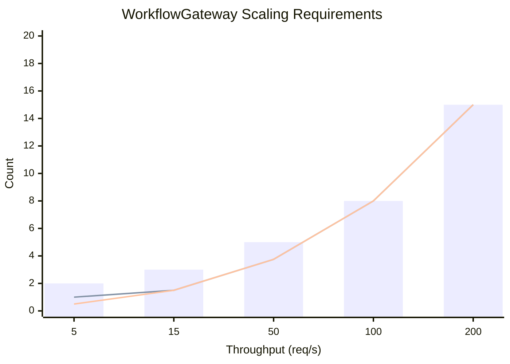
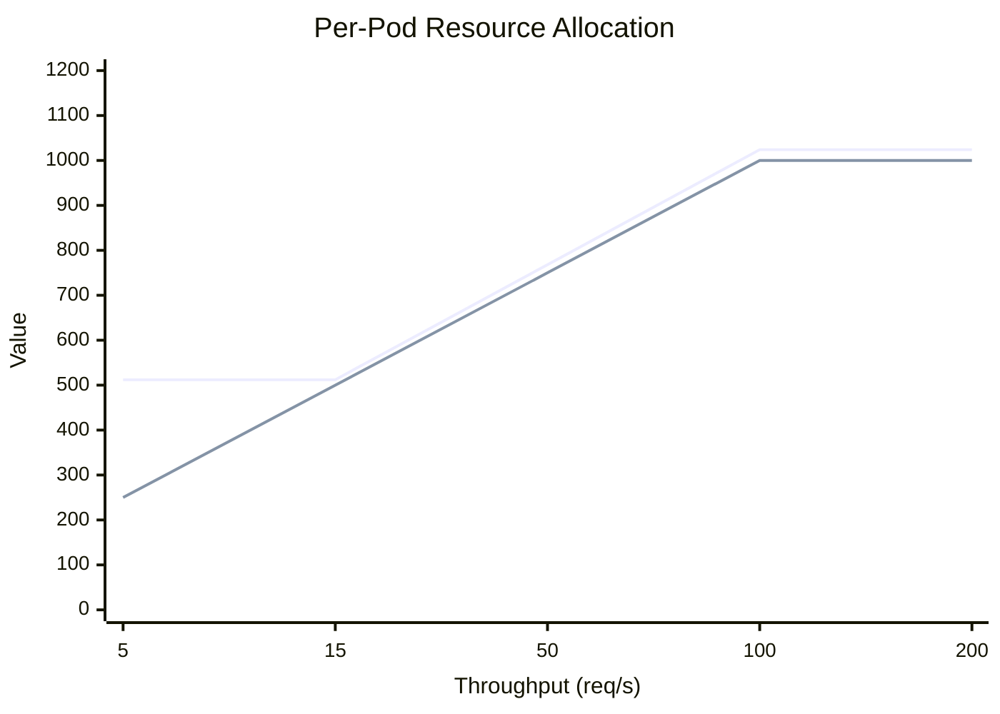

# WorkflowGateway Resource Recommendations

> Based on soak testing performed on 2025-12-06 with 5 req/s sustained load + 1 req/s large payload stress testing.

## Test Results Summary

| Metric | Value |
|--------|-------|
| Test Duration | 3 minutes |
| Request Rate | 6 req/s combined |
| Total Requests | ~1,080 |
| Workflow Success Rate | 100% |
| Memory (Initial) | 450 MB |
| Memory (Peak) | 634 MB |
| Memory (Final) | 395 MB |
| Memory Leak Detected | No |

---

## Per Pod Resource Recommendations

### WorkflowGateway

| Resource | Request | Limit | Rationale |
|----------|---------|-------|-----------|
| **Memory** | 512Mi | 1Gi | Peak was 634MB under load, headroom for spikes |
| **CPU** | 250m | 1000m | Mostly I/O bound (HTTP calls), CPU spikes during orchestration |

### Backend Services (e.g., Test API Server)

| Resource | Request | Limit |
|----------|---------|-------|
| **Memory** | 256Mi | 512Mi |
| **CPU** | 100m | 500m |

### PostgreSQL

| Resource | Request | Limit |
|----------|---------|-------|
| **Memory** | 512Mi | 2Gi |
| **CPU** | 250m | 1000m |

---

## HA Deployment Configuration

### Deployment Manifest

```yaml
apiVersion: apps/v1
kind: Deployment
metadata:
  name: workflow-gateway
  labels:
    app: workflow-gateway
spec:
  replicas: 3  # Minimum for HA
  strategy:
    type: RollingUpdate
    rollingUpdate:
      maxUnavailable: 1
      maxSurge: 1
  selector:
    matchLabels:
      app: workflow-gateway
  template:
    metadata:
      labels:
        app: workflow-gateway
    spec:
      affinity:
        podAntiAffinity:
          preferredDuringSchedulingIgnoredDuringExecution:
          - weight: 100
            podAffinityTerm:
              labelSelector:
                matchLabels:
                  app: workflow-gateway
              topologyKey: kubernetes.io/hostname
      topologySpreadConstraints:
      - maxSkew: 1
        topologyKey: topology.kubernetes.io/zone
        whenUnsatisfiable: ScheduleAnyway
        labelSelector:
          matchLabels:
            app: workflow-gateway
      containers:
      - name: gateway
        image: workflow-gateway:latest
        ports:
        - containerPort: 5001
        resources:
          requests:
            memory: "512Mi"
            cpu: "250m"
          limits:
            memory: "1Gi"
            cpu: "1000m"
        env:
        - name: ASPNETCORE_ENVIRONMENT
          value: "Production"
        - name: ConnectionStrings__DefaultConnection
          valueFrom:
            secretKeyRef:
              name: workflow-gateway-secrets
              key: database-connection
        livenessProbe:
          httpGet:
            path: /health
            port: 5001
          initialDelaySeconds: 10
          periodSeconds: 10
          timeoutSeconds: 5
          failureThreshold: 3
        readinessProbe:
          httpGet:
            path: /health
            port: 5001
          initialDelaySeconds: 5
          periodSeconds: 5
          timeoutSeconds: 3
          failureThreshold: 3
        startupProbe:
          httpGet:
            path: /health
            port: 5001
          initialDelaySeconds: 5
          periodSeconds: 5
          failureThreshold: 30  # Allow 2.5 minutes for startup
```

### Service Manifest

```yaml
apiVersion: v1
kind: Service
metadata:
  name: workflow-gateway
spec:
  selector:
    app: workflow-gateway
  ports:
  - port: 80
    targetPort: 5001
  type: ClusterIP
```

### HorizontalPodAutoscaler

```yaml
apiVersion: autoscaling/v2
kind: HorizontalPodAutoscaler
metadata:
  name: workflow-gateway-hpa
spec:
  scaleTargetRef:
    apiVersion: apps/v1
    kind: Deployment
    name: workflow-gateway
  minReplicas: 3
  maxReplicas: 10
  metrics:
  - type: Resource
    resource:
      name: cpu
      target:
        type: Utilization
        averageUtilization: 70
  - type: Resource
    resource:
      name: memory
      target:
        type: Utilization
        averageUtilization: 80
  behavior:
    scaleUp:
      stabilizationWindowSeconds: 60
      policies:
      - type: Pods
        value: 2
        periodSeconds: 60
    scaleDown:
      stabilizationWindowSeconds: 300  # Prevent flapping
      policies:
      - type: Pods
        value: 1
        periodSeconds: 120
```

### PodDisruptionBudget

```yaml
apiVersion: policy/v1
kind: PodDisruptionBudget
metadata:
  name: workflow-gateway-pdb
spec:
  minAvailable: 2
  selector:
    matchLabels:
      app: workflow-gateway
```

---

## Scaling Guide

| Throughput | Pods | Memory per Pod | CPU per Pod | Total Memory | Total CPU |
|------------|------|----------------|-------------|--------------|-----------|
| 5 req/s | 2 | 512Mi | 250m | 1Gi | 500m |
| 15 req/s | 3 | 512Mi | 500m | 1.5Gi | 1.5 cores |
| 50 req/s | 5 | 768Mi | 750m | 3.75Gi | 3.75 cores |
| 100 req/s | 8 | 1Gi | 1000m | 8Gi | 8 cores |
| 200 req/s | 15 | 1Gi | 1000m | 15Gi | 15 cores |

### Scaling Graph

```
Pods Required vs Throughput
───────────────────────────────────────────────────────────────────────

Pods
 16 │                                                              ●
    │                                                           ╱
 14 │                                                        ╱
    │                                                     ╱
 12 │                                                  ╱
    │                                               ╱
 10 │                                            ╱
    │                                     ●───╱
  8 │                                  ╱
    │                               ╱
  6 │                            ╱
    │                    ●────╱
  4 │                 ╱
    │        ●─────╱
  2 │  ●──╱
    │
  0 └───────┬───────┬───────┬───────┬───────┬───────┬───────┬───────┬──
            25      50      75     100     125     150     175     200
                              Throughput (req/s)

Legend: ● = measured scaling point
```

```
Total Resources vs Throughput
───────────────────────────────────────────────────────────────────────

Memory (Gi)                                                    CPU (cores)
 16 │                                              ● Memory        16
    │                                           ╱    ○ CPU
 14 │                                        ╱                     14
    │                                     ╱
 12 │                                  ╱                           12
    │                               ╱
 10 │                            ╱                                 10
    │                     ●───╱  ○
  8 │                  ╱     ╱                                      8
    │               ╱     ╱
  6 │            ╱     ╱                                            6
    │         ╱     ╱
  4 │      ●─    ○─                                                 4
    │   ╱     ╱
  2 │●─   ○─   ○                                                    2
    │  ╱
  0 └───────┬───────┬───────┬───────┬───────┬───────┬───────┬──    0
            25      50      75     100     125     150     175
                              Throughput (req/s)
```

### Mermaid Chart (for GitHub rendering)





### Scaling Formula

```
pods = ceil(target_req_per_sec / 5) + 1  # +1 for headroom
memory_per_pod = 512Mi + (100Mi * ceil(avg_workflow_tasks / 5))
cpu_per_pod = 250m + (100m * ceil(target_req_per_sec / 10))
```

---

## Total Cluster Resources (Minimal HA)

| Component | Pods | Memory (request) | Memory (limit) | CPU (request) | CPU (limit) |
|-----------|------|------------------|----------------|---------------|-------------|
| Gateway | 3 | 1.5Gi | 3Gi | 750m | 3 cores |
| PostgreSQL | 2 | 1Gi | 4Gi | 500m | 2 cores |
| **Total** | **5** | **2.5Gi** | **7Gi** | **1.25 cores** | **5 cores** |

---

## Memory Behavior Analysis

### Observed Pattern (3-minute soak test)

```
Memory RSS (MB) over time:

634 |        *                               Peak under load
600 |      *   *
500 |    *       * *   * * * *   * * *   * *  Normal operating range
450 |  *           * * *     * *       *
400 |*                             *   *     After GC
370 |                        *                Minimum
    +------------------------------------------
    0s                1m30s                  3m

Key: * = Memory sample (5-second intervals)
```

### Interpretation

| Observation | Status | Notes |
|-------------|--------|-------|
| Memory leak | None | Final < Initial |
| GC pressure | Normal | Saw-tooth pattern indicates healthy GC |
| Peak memory | Acceptable | 634 MB < 1 GB limit |
| Recovery | Good | Returns to baseline after load |

---

## Production Checklist

### Before Deployment

- [ ] Set resource requests and limits
- [ ] Configure HPA with appropriate thresholds
- [ ] Set up PodDisruptionBudget (min 2 available)
- [ ] Configure pod anti-affinity for zone spread
- [ ] Set up health/readiness/startup probes
- [ ] Configure connection pooling for PostgreSQL
- [ ] Set up monitoring and alerting

### Monitoring Metrics

| Metric | Warning | Critical |
|--------|---------|----------|
| Memory usage | >70% | >85% |
| CPU usage | >70% | >85% |
| Pod restarts | >1/hour | >3/hour |
| Request latency p95 | >2s | >5s |
| Error rate | >1% | >5% |

### Alerts

```yaml
# Example Prometheus alert rules
groups:
- name: workflow-gateway
  rules:
  - alert: HighMemoryUsage
    expr: container_memory_usage_bytes{container="gateway"} / container_spec_memory_limit_bytes > 0.85
    for: 5m
    labels:
      severity: critical
    annotations:
      summary: "Gateway memory usage > 85%"

  - alert: HighCPUUsage
    expr: rate(container_cpu_usage_seconds_total{container="gateway"}[5m]) > 0.85
    for: 5m
    labels:
      severity: warning

  - alert: PodRestarting
    expr: increase(kube_pod_container_status_restarts_total{container="gateway"}[1h]) > 3
    labels:
      severity: critical
```

---

## Testing Commands

```bash
# Run soak test (memory leak detection)
cd tests/load
DURATION=1h RATE=5 ./run-soak-test.sh

# Run spike test (burst handling)
BASELINE_RATE=5 SPIKE_MULTIPLIER=10 k6 run spike-test.js

# Quick 3-minute test
DURATION=3m RATE=5 ./run-soak-test.sh
```

---

## Version History

| Date | Version | Notes |
|------|---------|-------|
| 2025-12-06 | 1.0 | Initial recommendations based on soak testing |
