# Technical Wiki: Workflow Orchestration Engine

> A deep-dive for engineers evaluating this Kubernetes-native workflow orchestration platform.

---

## 1. Executive Summary

> **What is this?** A Kubernetes-native workflow orchestration engine that transforms your integration architecture from **mudball to hub-and-spoke** — with automation.

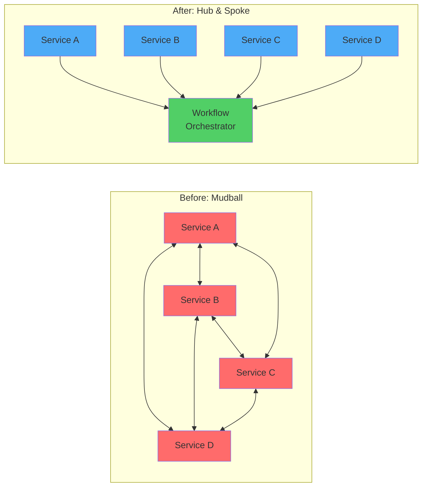

| Mudball | Hub & Spoke |
|---------|-------------|
| N×N integration points | N+1 connections |
| Retry logic in every service | Central retry policy |
| One change = 30 PRs | One change = 1 task update |
| "Works on my machine" | Schema-validated at deploy |
| Debug via log diving | Execution traces + time-travel |

### At a Glance

| Metric | Value | What It Means |
|--------|-------|---------------|
| Total Tests | 3,900+ | Not a toy project |
| Code Coverage | ≥90% | Enforced, not aspirational |
| Mutation Score | ≥80% | Tests actually test things |
| Stages Complete | 22/37 (60%) | Production-ready core |
| Vulnerabilities | 0 | Security-scanned every commit |

### Key Differentiators

- **Fail-fast validation** at `kubectl apply` (not runtime surprises)
- **Visual workflow builder** for non-engineers
- **AI-powered generation** via Claude + MCP
- **3D real-time visualization** of execution
- **Obsessive TDD discipline** from day one

---

## 2. The Problem This Solves

### Copy-Paste Hell

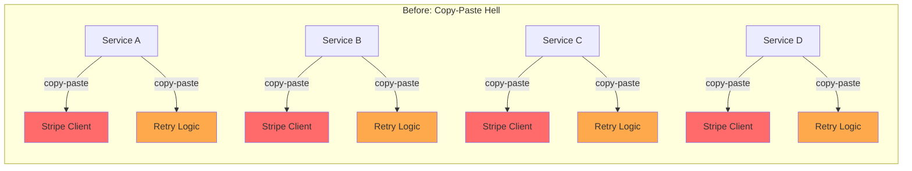

**The Pain:**
- 4 services = 4 copies of Stripe client code
- Retry logic duplicated across 50+ microservices
- Provider change (Stripe → Braintree) = touching 30+ codebases
- Bug fix in one = manual copy to all others

### The Solution: Composable Task Library

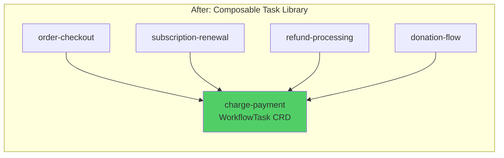

**The Win:**
- Platform team builds `charge-payment` task **ONCE**
- 4 workflows reuse it instantly
- Provider migration = update 1 task, test 1 time, deploy 1 PR
- Retry logic built into task, not scattered

---

## 3. Core Capabilities

### 3.1 Schema Validation & Type Safety

- **JsonSchema.Net 5.x** integration for RFC-compliant validation
- **Recursive type compatibility checking** between task outputs → inputs
- **Design-time validation** catches errors before deployment
- Incompatible schemas rejected at `kubectl apply`

```yaml
# Example: Input schema for a payment task
inputSchema:
  type: object
  properties:
    amount:
      type: number
      minimum: 0.01
    currency:
      type: string
      enum: [USD, EUR, GBP]
  required: [amount, currency]
```

### 3.2 Template Expression System

Reference workflow inputs and upstream task outputs:

```yaml
tasks:
  - id: fetch-user
    input:
      userId: "{{input.userId}}"          # From workflow input

  - id: send-email
    input:
      email: "{{tasks.fetch-user.output.email}}"   # From upstream task
      items: "{{tasks.fetch-user.output.orders[0].items}}"  # Array access
```

**Features:**
- Dot notation: `{{input.nested.field}}`
- Array indexing: `{{items[0].name}}`
- Full JSON serialization for object references
- Compile-time template validation

### 3.3 Execution Graph & Parallelism

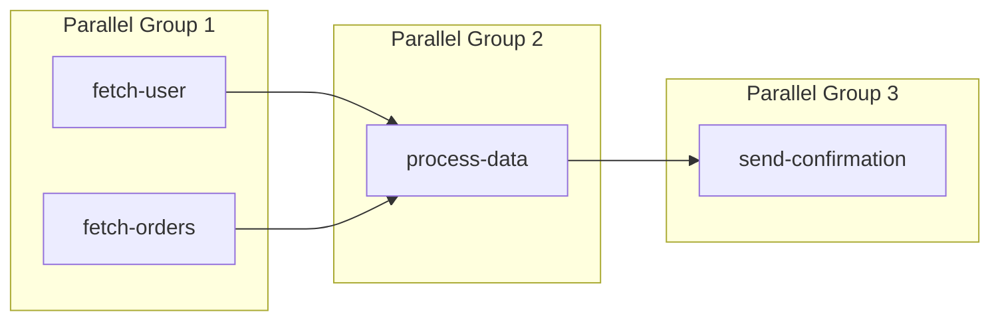

**Features:**
- **Automatic dependency detection** (explicit `dependsOn` + implicit template refs)
- **Cycle detection** with clear error messages showing the cycle path
- **Parallel execution** of independent tasks (2x+ speedup)
- **Configurable parallelism limits** via SemaphoreSlim

### 3.4 HTTP Task Execution

```yaml
apiVersion: workflow.io/v1
kind: WorkflowTask
metadata:
  name: charge-payment
spec:
  type: http
  http:
    method: POST
    url: "https://api.stripe.com/v1/charges"
    headers:
      Authorization: "Bearer {{input.apiKey}}"
    body: |
      {
        "amount": {{input.amount}},
        "currency": "{{input.currency}}"
      }
  timeout: "30s"
  inputSchema: { ... }
  outputSchema: { ... }
```

**Features:**
- **Retry policy:** Exponential backoff (100ms → 200ms → 400ms → ... capped at 30s)
- **Per-task timeouts:** `30s`, `5m`, `500ms` syntax
- **Structured error classification:** Timeout, NetworkError, RateLimitError, AuthenticationError, etc.
- **Response handlers:** JSON (default), XML, plain text

### 3.5 Transform DSL

40+ operations for data transformation without code:

```yaml
- id: transform-users
  taskRef: transform
  input:
    source: "{{tasks.fetch-users.output}}"
    pipeline:
      - operation: filter
        field: active
        operator: eq
        value: true
      - operation: map
        mappings:
          userId: id
          fullName: "name"
      - operation: sort
        field: fullName
        order: asc
      - operation: limit
        count: 10
```

**Available Operations:**
- **Data:** select, filter, map, flatMap, flatten, unique, limit, skip, reverse
- **Aggregation:** groupBy, aggregate (sum, avg, count, min, max), join, sortBy
- **Strings:** uppercase, lowercase, trim, split, concat, replace, substring, template
- **Math:** round, floor, ceil, abs, clamp, scale, percentage
- **Random:** randomOne, randomN, shuffle

### 3.6 Real-Time Execution Events

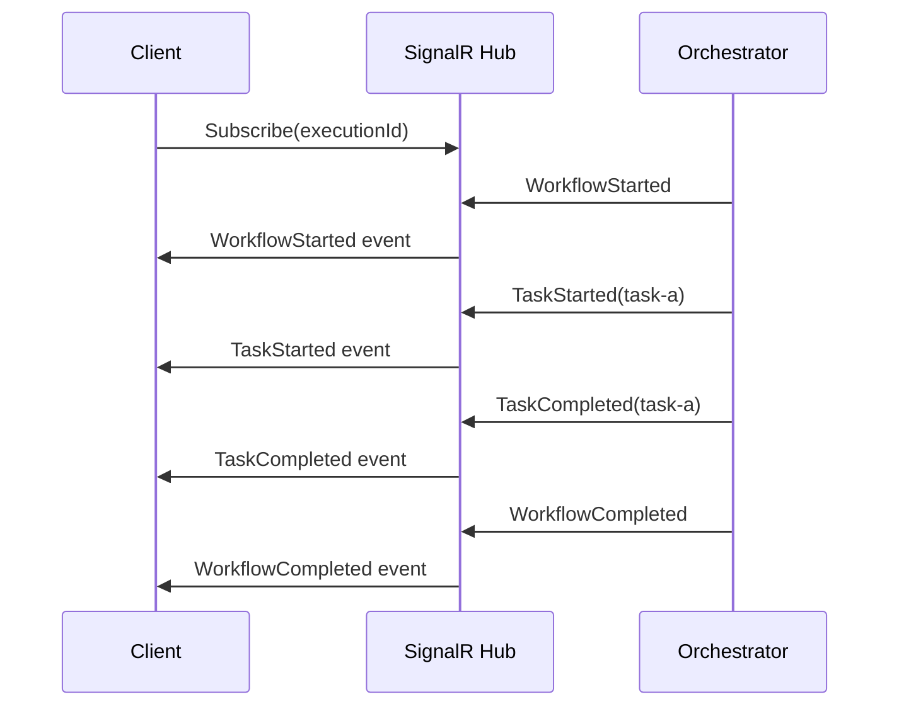

**Features:**
- **SignalR WebSocket hub** for push notifications
- **Events:** WorkflowStarted, TaskStarted, TaskCompleted, WorkflowCompleted, SignalFlow
- **Sub-100ms latency** for event delivery
- **Connection pooling** and automatic reconnection
- **No polling required**

### 3.7 Debugging & Observability

| Feature | What It Does |
|---------|--------------|
| **Execution Traces** | Wait time analysis per task, dependency resolution order |
| **Parallelism Detection** | Planned vs actual parallel groups from timing analysis |
| **Time-Travel UI** | Scrub through execution timeline at 1x, 10x, 100x speed |
| **Step-Through Mode** | Pause at each task, manual approval to continue |
| **Execution Comparison** | Side-by-side diff of two executions |
| **Variable Watcher** | Track specific data across task chain |

---

## 4. Why You Should Trust It Won't Break

> **TL;DR:** 3,300+ tests, 90%+ coverage, mutation testing, admission webhooks, and audit trails for every stage. This isn't a "move fast and break things" project.

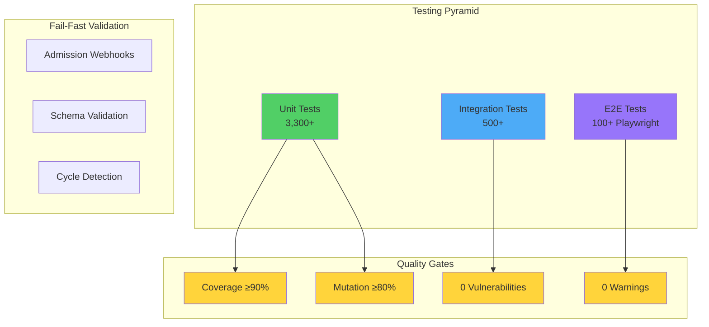

### 4.1 Test Coverage & TDD Enforcement

| Metric | Value | Enforcement |
|--------|-------|-------------|
| Unit Tests | 3,300+ | CI blocks on failure |
| Integration Tests | 500+ | CI blocks on failure |
| E2E Tests | 100+ | CI blocks on failure |
| Code Coverage | ≥90% | CI blocks if below |
| Mutation Score | ≥80% | Stryker.NET |

**TDD is Non-Negotiable:**

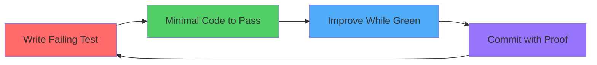

Every feature has tests written **FIRST**. No exceptions.

### 4.2 Quality Gates (8 Mandatory per Stage)

| Gate | What It Checks |
|------|----------------|
| 1 | No template files (Class1.cs, UnitTest1.cs) |
| 2 | Linting passes (0 errors) |
| 3 | Build succeeds (0 warnings, 0 errors) |
| 4 | Type safety (TypeScript only) |
| 5 | All tests pass (0 failures, 0 skipped) |
| 6 | Coverage ≥90% |
| 7 | Security scan (0 vulnerabilities) |
| 8 | Proof file complete (no placeholders) |

### 4.3 Fail-Fast Validation

Errors are caught at **deploy time**, not runtime:

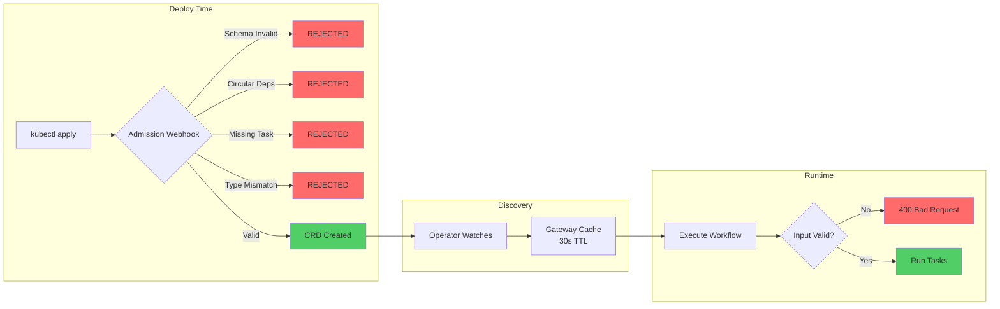

**Example: What gets caught at deploy time:**

```yaml
# This workflow would be REJECTED at kubectl apply:
tasks:
  - id: task-a
    dependsOn: [task-b]  # ← Circular!
  - id: task-b
    dependsOn: [task-a]  # ← Error: "Circular dependency: task-a → task-b → task-a"
```

### 4.4 Mutation Testing (Stryker.NET)

Tests aren't just passing — they're **meaningful**:

- Mutants killed: 80%+ score required
- Catches "tests that pass but don't actually verify behavior"
- Runs on every stage completion

### 4.5 Stage Proof Files (Audit Trail)

Every completed stage has a proof file documenting:
- Exact test counts and pass rates
- Coverage percentages
- Build output (warnings, errors)
- Security scan results
- Principal Engineer review with risks identified

See: `stage-proofs/stage-X.Y/STAGE_X.Y_PROOF.md`

### 4.6 Performance Benchmarks

- **BenchmarkDotNet** baselines for critical paths
- **Orchestration overhead** tracked (<5% target)
- **P50/P95/P99 latency** monitoring
- **Automatic alerts** on performance degradation

---

## 5. What Gets Better If You Adopt This

### 5.1 For Platform Teams

| Before | After |
|--------|-------|
| Build HTTP client for every team | Build task library once, 50+ teams reuse |
| Debug retry logic in each service | Central retry policy, one place to fix |
| Provider migration = 30+ PRs | Update one task, test once, deploy once |
| "Works on my machine" integration issues | Schema validation catches at design time |

### 5.2 For Product Teams

| Before | After |
|--------|-------|
| 2 weeks to integrate new API | 5 minutes to compose workflow from tasks |
| Write YAML from scratch | Start from template library |
| Debug via log diving | Time-travel UI, execution traces |
| "Why is this slow?" guessing | Execution trace shows exact bottleneck |

### 5.3 Velocity Improvements

- **First workflow:** <5 minutes (vs 2 weeks)
- **Template reuse:** 70%+ workflows start from templates
- **Debugging time:** 5x faster (traces vs logs)
- **Integration testing:** Built into dry-run mode

### 5.4 Risk Reduction

- **Zero runtime type surprises:** Schema validation at deploy
- **No circular dependency outages:** Detected at `kubectl apply`
- **Provider hot-swap:** 30-second cache TTL
- **Rollback safety:** Workflow versioning with SHA256 hashes

---

## 6. Architecture

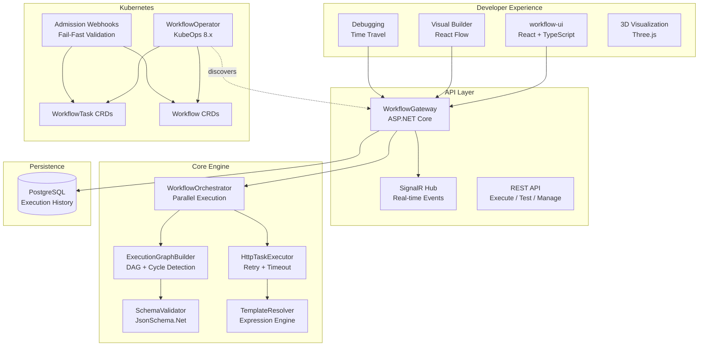

### How Workflows Execute

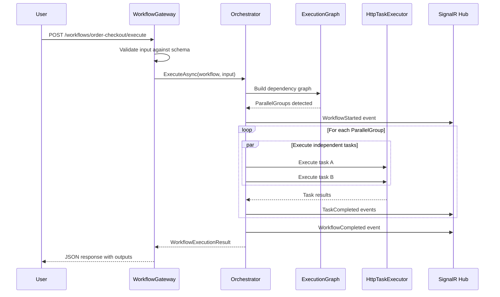

---

## 7. Adoption Path

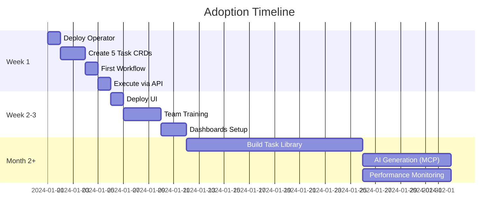

### Week 1: Minimal Viable Adoption

1. Deploy operator to existing K8s cluster
2. Create 3-5 WorkflowTask CRDs for common APIs
3. Compose first workflow
4. Execute via REST API

### Week 2-3: Team Onboarding

1. Deploy workflow-ui for visual building
2. Train product teams on template library
3. Set up execution history and dashboards

### Month 2+: Platform Maturity

1. Build comprehensive task library
2. Enable AI-powered workflow generation (MCP)
3. Set up performance monitoring and alerting

### The Reusability Multiplier

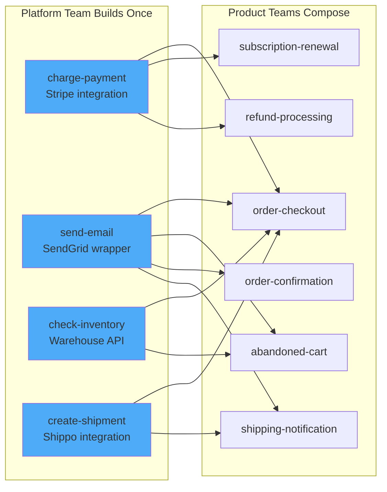

**Result:** 4 tasks → 6 workflows. Build once, compose many.

---

## 8. What This Is NOT

| NOT For | IS For |
|---------|--------|
| Long-running jobs (hours/days) | Synchronous calls (max 30 seconds) |
| Async pause/resume workflows | Real-time request/response |
| Replacing Airflow/Prefect/Temporal | Microservice composition |
| Infrastructure orchestration | API orchestration |

**Perfect For:**
- Microservice composition
- Real-time API orchestration
- User-facing synchronous workflows
- Payment/notification/integration pipelines

---

## 9. Technology Stack

| Layer | Technology |
|-------|------------|
| Backend | .NET 8, ASP.NET Core, System.Text.Json |
| Kubernetes | KubeOps 8.x, CRDs, Admission Webhooks |
| Schema | JsonSchema.Net 5.x |
| Database | PostgreSQL 15 |
| Frontend | React 18, TypeScript, React Flow, Three.js |
| Real-time | SignalR (WebSocket) |
| Testing | xUnit, Moq, FluentAssertions, Stryker.NET |
| Performance | BenchmarkDotNet, NBomber |

---

## 10. Current Status

**60% Complete (22/37 stages)**

| Category | Stages | Status |
|----------|--------|--------|
| Core Engine | 1-7.9 | ✅ Complete |
| Developer Experience | 9.1-9.6.1 | ✅ Complete |
| Performance | 10.1-10.2 | ✅ Complete |
| Visualizations | 12.1-12.5 | ✅ Complete |
| AI Generation | 13 | ✅ Complete |
| Optimization Engine | 14 | 🔄 Planned |
| Test Infrastructure | 16-17 | 🔄 Planned |

---

## Quick Links

- **API Docs:** `/swagger` on WorkflowGateway
- **Visual Builder:** `/workflows/new` on workflow-ui
- **Execution History:** `/executions` on workflow-ui
- **3D Visualization:** `/visualization/galaxy` on workflow-ui

---

*Last updated: 2025-12-03*
